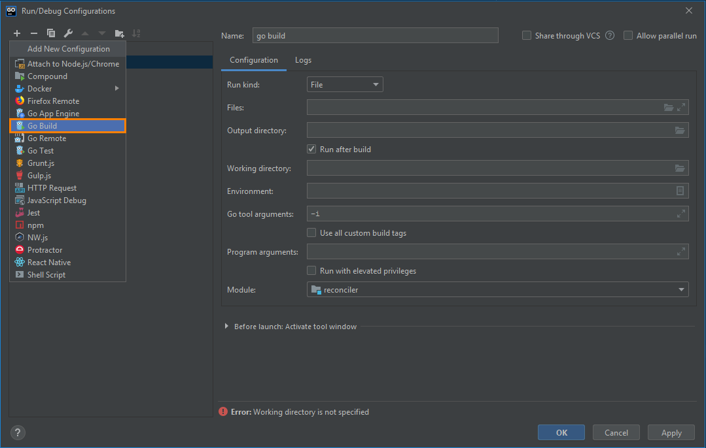

# Local Development

## Requirements

* GoLang version higher than 1.13;

!!! note
    The GOPATH and GOROOT environment variables should be added in PATH.

* PostgreSQL client version higher than 9.5;
* Configured access to the VCS, for details, refer to the [Gerrit Setup for Developer](gerrit-configuration.md) page;
* GoLand Intellij IDEA or another IDE.

## Start Operator

In order to run the operator, follow the steps below:

1. Clone repository;

2. Open folder in GoLand Intellij IDEA, click the  button and select the **Go Build** option:

  

3. In Configuration tab, fill in the following:

  3.1. In the Field field, indicate the path to the main.go file;

  3.2. In the Working directory field, indicate the path to the operator;

  3.3. In the Environment field, specify the platform name (OpenShift/Kubernetes);

    

4. Create the PostgreSQL database, schema, and a user for the EDP Admin Console operator:

  * Create database with a user:

        CREATE DATABASE edp-db WITH ENCODING 'UTF8';
        CREATE USER postgres WITH PASSWORD 'password';
        GRANT ALL PRIVILEGES ON DATABASE 'edp-db' to postgres;

  * Create a schema:

        CREATE SCHEMA [IF NOT EXISTS] 'develop';

   EDP Admin Console operator supports two modes for running: local and prod.
   For local deploy, modify `edp-admin-console/conf/app.conf` and set the following parameters:

        runmode=local
        [local]
        dbEnabled=true
        pgHost=localhost
        pgPort=5432
        pgDatabase=edp-db
        pgUser=postgres
        pgPassword=password
        edpName=develop

5. Run `go build main.go` (Shift+F10);

6. After the successful setup, follow the [http://localhost:8080](http://localhost:8080) URL address to check the result:

  

## Exceptional Cases

After starting the Go build process, the following error will appear:

```
go: finding github.com/openshift/api v3.9.0
go: finding github.com/openshift/client-go v3.9.0
go: errors parsing go.mod:
C:\Users\<<username>>\Desktop\EDP\edp-admin-console\go.mod:36: require github.com/openshift/api: version "v3.9.0" invalid: unknown revision v3.9.0

Compilation finished with exit code 1
```

To resolve the issue, update the go dependency by applying the Golang command:

```
go get github.com/openshift/api@v3.9.0
```
