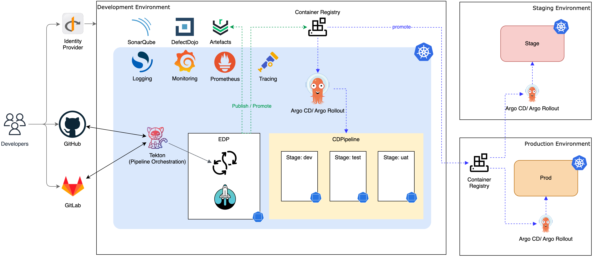

# Reference Architecture

The EPAM Delivery Platform’s (EDP) Reference Architecture serves as a blueprint for software delivery, outlining the best practices, tools, and technologies leveraged by the platform to ensure efficient and high-quality software development. It provides a comprehensive guide to navigate the complexities of software delivery, from code to deployment.

EDP operates on Kubernetes, a leading open-source system for automating deployment, scaling, and management of containerized applications. It consolidates a variety of open-source tools, ensuring a flexible and adaptable system that can seamlessly run on any public cloud or on-premises infrastructure. This versatility allows for a wide range of deployment options, **catering to diverse business needs** and **operational requirements**.

## Key Principles

The EPAM Delivery Platform (EDP) is built on a set of key principles that guide its design and functionality:

* **Managed Infrastructure and Container Orchestration:** EDP is based on a platform that leverages managed infrastructure and container orchestration, primarily through Kubernetes or OpenShift.

* **Security:** EDP places a high emphasis on security, covering aspects such as authentication, authorization, and Single Sign-On (SSO) for platform services.

* **Development and Testing Toolset:** EDP provides a comprehensive set of tools for development and testing, ensuring a robust and reliable software delivery process.

* **Well-Established Engineering Process:** EDP reflects EPAM’s well-established engineering practices (EngX) in its CI/CD pipelines and delivery analytics.

* **Open-Source and Cloud-Agnostic:** As an open-source, cloud-agnostic solution, EDP can be run on any preferred Kubernetes or OpenShift clusters.

* **DevSecOps Excellence:** EDP empowers DevSecOps by making security a mandatory quality gate.

* **Automated Testing:** EDP ensures seamless and predictable regression testing through automated test analysis.

## Architecture Overview

EDP encompasses a comprehensive CI/CD ecosystem integrating essential tools such as the **Tekton** and **Argo CD**, augmented by additional functionalities. Within this robust framework, EDP seamlessly integrates **SonarQube** for continuous code quality assessment, enabling thorough analysis and ensuring adherence to coding standards. Additionally, incorporating **Static Application Security Testing (SAST)** toolset fortifies platform's security posture by proactively identifying vulnerabilities within the codebase. EDP leverages dedicated artifact storage solutions to manage and version application artifacts securely, ensuring streamlined deployment processes and traceability throughout the software development lifecycle. See the reference architecture diagram below.

{ width="100%" }

## Technology Stack

The Platform is meticulously engineered to uphold best practices in workload distribution across various environments, including development, testing (manual/automation), user acceptance (UAT), staging, and production. While lower environments like development and testing may feasibly share clusters for workload efficiency, EDP strongly advocates and enforces the necessity of **segregating production workloads into dedicated clusters**. This segregation ensures the highest isolation, security, and resource allocation levels for mission-critical production systems, adhering to industry standards and ensuring optimal operational integrity.

EDP harnesses the robust capabilities of Kubernetes in conjunction with a suite of powerful tools tailored for monitoring, logging, and tracing. It integrates the **Prometheus** stack within ecosystem, leveraging its metrics collection, storage, and querying capabilities to enable comprehensive monitoring of system performance and health. EDP runs **OpenSearch** for centralized logging, enabling efficient log aggregation, analysis, and management across the platform. Incorporating **OpenTelemetry** enables standardized and seamless observability data collection, facilitating deep insights into platform behavior and performance. Additionally, it allows for connection with external aggregators and tools that support the OpenTelemetry protocol (OTLP).

{ width="100%" }

EDP integrates with GitLab, GitHub, and Gerrit for version control. These systems are foundational components enabling efficient source code management, collaboration, and code review processes.

Platform ensures robust security measures by leveraging OpenID Connect (OIDC) for authentication and authorization across all platform tools and Kubernetes clusters. By employing OIDC, EDP establishes a unified and secure authentication mechanism, enabling seamless access control and user authentication for all tools integrated into the platform. This standardized approach ensures stringent security protocols, maintaining authentication consistency and authorization policies across the platform ecosystem.
