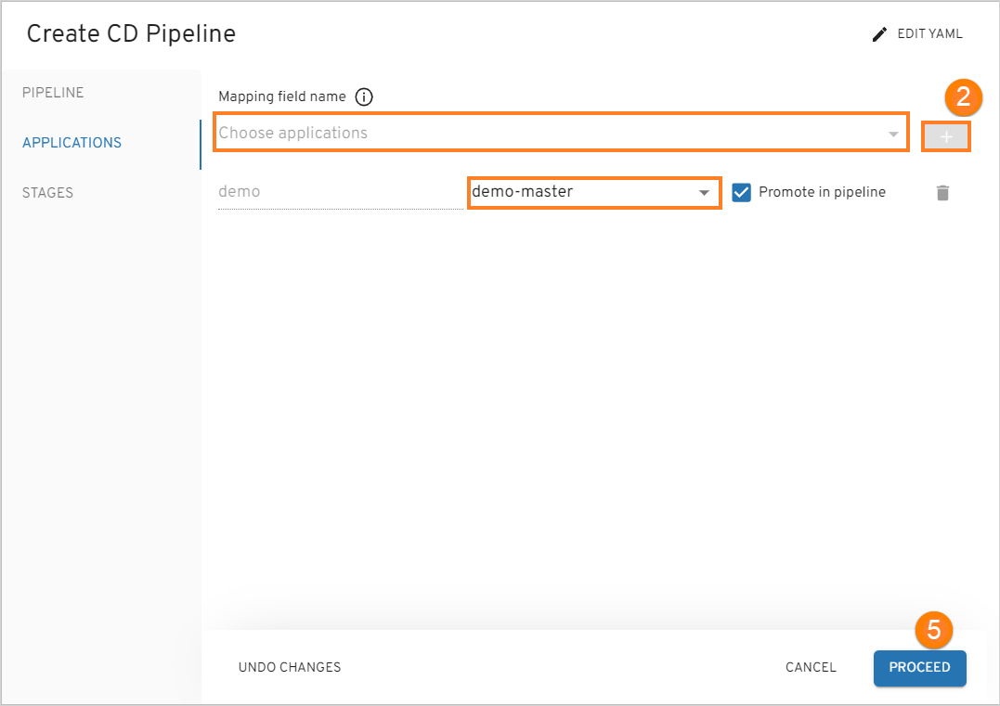
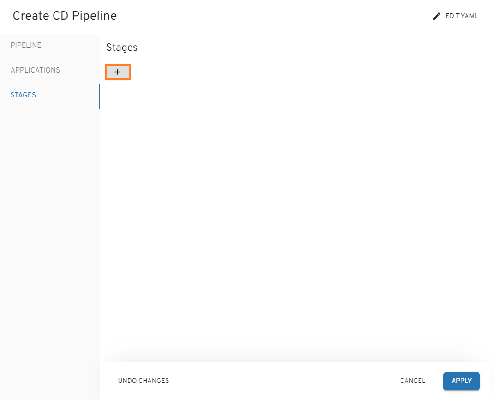
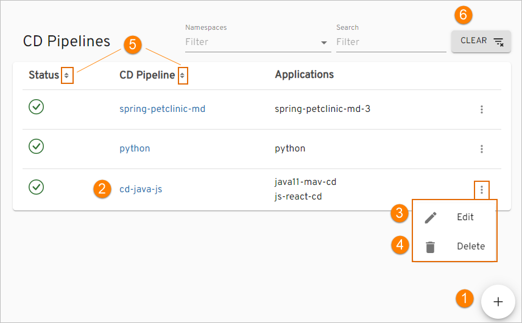
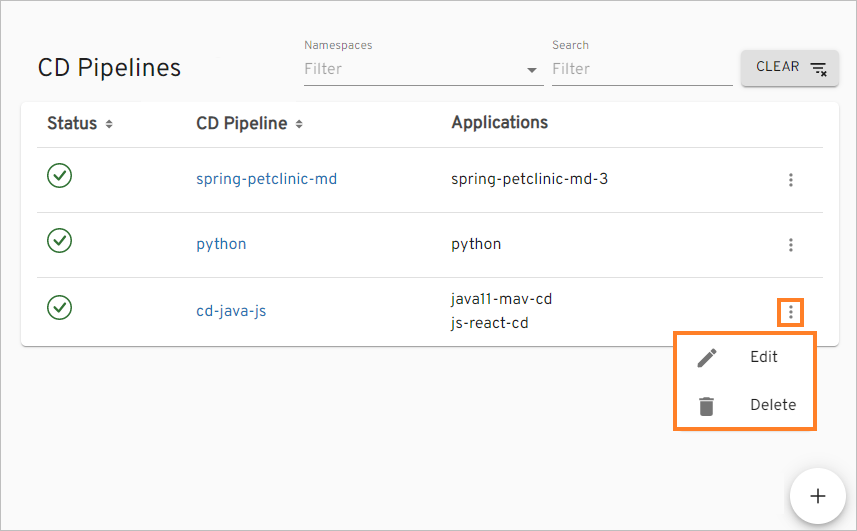
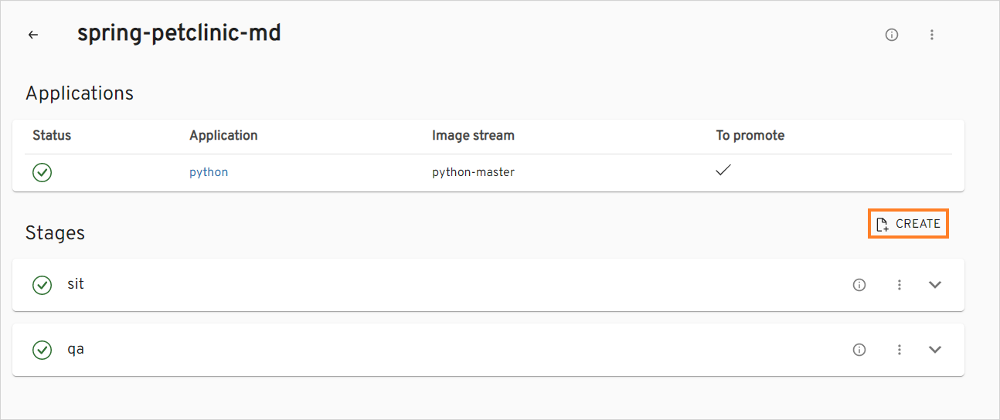
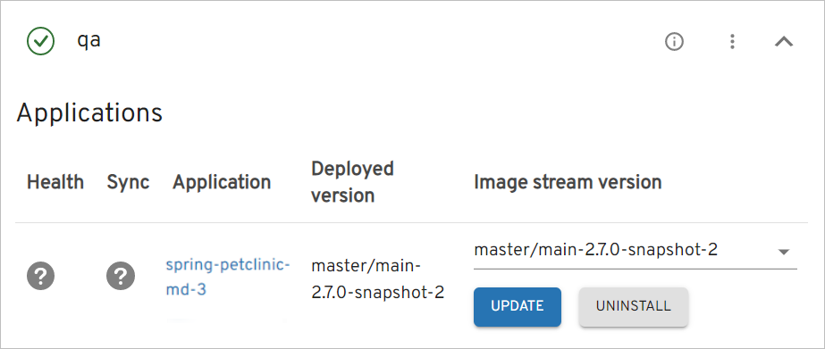

# Add CD Pipeline

Headlamp provides the ability to deploy an environment on your own and specify the essential components.

Navigate to the **CD Pipelines** section on the navigation bar and click **Create** (the plus sign icon in the lower-right corner of the screen). Once clicked, the **Create CD Pipeline** dialog will appear.

The creation of the CD pipeline becomes available as soon as an application is created including its provisioning
in a branch and the necessary entities for the environment. You can create the CD pipeline [in YAML](#YAML) or [via the three-step menu](#menu) in the dialog.

[//]: # (After the complete adding of the CD pipeline, inspect the [Check CD Pipeline Availability]&#40;#check-cd-pipeline-availability&#41;)

[//]: # (part.)

## Create CD Pipeline in YAML 
Click **Edit YAML** in the upper-right corner of the **Create CD Pipeline** dialog to open the YAML editor and create the CD Pipeline.

!

To edit YAML in the minimal editor, turn on the **Use minimal editor** toggle in the upper-right corner of the **Create CD Pipeline** dialog.

To save the changes, select the **Save & Apply** button.

## Create CD Pipeline in the Dialog 
The **Create CD Pipeline** dialog contains the three steps:

* The Pipeline Menu
* The Applications Menu
* The Stages Menu

### The Pipeline Menu

The **Pipeline** tab of the **Create CD Pipeline** menu should look like the picture below:

!

1. Type the name of the pipeline in the **Pipeline Name** field by entering at least two characters and by using
the lower-case letters, numbers and inner dashes.

  !!! note
      The namespace created by the CD pipeline has the following pattern combination: **[edp namespace]-[cd pipeline name]-[stage name]**.
      Please be aware that the namespace length should not exceed 63 symbols.

2. Select the deployment type from the drop-down list:

  * Container - the pipeline will be deployed in a Docker container;
  * Custom - this mode allows to deploy non-container applications and customize the Init stage of CD pipeline.

3. Click the **Proceed** button to switch to the next menu.

### The Applications Menu

The **Pipeline** tab of the **Create CD Pipeline** menu should look like the picture below:

  !

1. Select the necessary application from the **Mapping field name** drop-down menu.
2. Select the plus sign icon near the selected application to specify the necessary codebase Docker branch for the application (the output for the branch and other stages from other CD pipelines).
3. Select the application branch from the drop-down menu.
4. Select the **Promote in pipeline** check box in order to transfer the application from one to another stage
  by the specified codebase Docker branch. If the **Promote in pipeline** check box is not selected,
  the same codebase Docker stream will be deployed regardless of the stage, i.e. the codebase Docker stream input,
  which was selected for the pipeline, will always be used.

  !!! note
      The newly created CD pipeline has the following pattern combination: [pipeline name]-[branch name].
      If there is another deployed CD pipeline stage with the respective codebase Docker stream (= image stream as an OpenShift term),
      the pattern combination will be as follows: [pipeline name]-[stage name]-[application name]-[verified].

5. Click the **Proceed** button to switch to the next menu.

### The Stages Menu

1. Click the plus sign icon in the **Stages** menu and fill in the necessary fields in the Adding Stage window :

  !

  !

  a. Type the stage name;

  !!! note
      The namespace created by the CD pipeline has the following pattern combination: **[cluster name]-[cd pipeline name]-[stage name]**.
      Please be aware that the namespace length should not exceed 63 symbols.

  b. Enter the description for this stage;

  c. Select the trigger type. The available trigger types are _Manual_ and _Auto_. By selecting the _Auto_ trigger type, the CD pipeline will be launched automatically after the image is built.
  Every trigger type has a set of default stages that differ by the input stage (auto-deploy-input or manual-deploy-input).

  !!! note
      When changing the Trigger Type, the job-provision automatically will change the set of stages to the corresponding stages set for the CD pipeline.

  d. Select the job provisioner. In case of working with non-container-based applications, there is an option to use
  a custom job provisioner. Please refer to the [Manage Jenkins CD Job Provision](../operator-guide/manage-jenkins-cd-job-provision.md)
  page for details.

  e. Select the groovy-pipeline library;

  f. Select the branch;

  g. Add an unlimited number of quality gates by clicking a corresponding plus sign icon and remove them as well
  by clicking the recycle bin icon;

  h. Type the step name, which will be displayed in Jenkins/Tekton, for every quality gate;

  i. Select the quality gate type:

  * Manual - means that the promoting process should be confirmed in Jenkins/Tekton manually;
  * Autotests - means that the promoting process should be confirmed by the successful passing of the autotests.

  In the additional fields, select the previously created autotest name (j) and specify its branch for the autotest
  that will be launched on the current stage (k).

  !!! note
      Execution sequence. The image promotion and execution of the pipelines depend on the sequence in which
      the environments are added.

  l. Click the **Apply** button to display the stage in the Stages menu.

  !

2. Edit the stage by clicking its name and applying changes, and remove the added stage by clicking the recycle bin icon
   next to its name.

3. Click the **Apply** button to start the provisioning of the pipeline. After the CD pipeline is added, the new project
with the stage name will be created in OpenShift.

## Manage CD Pipeline

As soon as the CD pipeline is provisioned and added to the CD Pipelines list, there is an ability to:

  !

1. Create another application by clicking the plus sign icon in the lower-right corner of the screen and performing the same steps as described
in the [Add CD Pipeline](#add-cd-pipeline) section.

2. Open CD pipeline data by clicking its link name. Once clicked, the following blocks will be displayed:

  * **General Info** - displays common information about the CD pipeline, such as name and deployment type.
  * **Applications** - displays the CD pipeline applications to promote.
  * **Stages** - displays the CD pipeline stages and stage metadata (by selecting the information icon near the stage name); allows to [add](#add-stage), [edit](#edit-stage) and [delete](#delete-stage) stages, as well as deploy or uninstall image stream versions of the related applications for a stage.
  * **Metadata** - displays the CD pipeline name, namespace, creation date, finalizers, generation, resource version, and UID. Open this block by selecting the information icon near the options icon next to the CD pipeline name.

3. Edit the CD pipeline by selecting the options icon next to its name in the CD Pipelines list, and then selecting **Edit**. For details see the [Edit Existing CD Pipeline](#edit-existing-pipeline) section.

4. Delete the added CD pipeline by selecting the options icon next to its name in the CD Pipelines list, and then selecting **Delete**.

  !!! info
      In OpenShift, if the deployment fails with the ImagePullBackOff error, delete the POD.

5. Sort the existing CD pipelines in a table by clicking the sorting icons in the table header. When sorting by name, the CD pipelines will be displayed in alphabetical order. You can also sort the CD pipelines by their status.

6. Search the necessary CD pipeline by the namespace or by entering the corresponding name, language or the build tool into the **Filter** tool.

7. Select a number of CD pipelines displayed per page (15, 25 or 50 rows) and navigate between pages if the number of CD pipelines exceeds the capacity of a single page.

### Edit Existing CD Pipeline

Edit the CD pipeline directly from the CD Pipelines overview page or when viewing the CD Pipeline data:

1. Select **Edit** in the options icon menu next to the CD pipeline name:

  !

  !

2. Apply the necessary changes (edit the list of applications for deploy, application branches, and promotion in the pipeline). Add new extra stages by clicking the plus sign icon and filling in the application branch and promotion in the pipeline.

   !

3. Select the **Apply** button to confirm the changes.

### Add a New Stage

In order to create a new stage for the existing CD pipeline, follow the steps below:

1. Navigate to the **Stages** block by clicking the CD pipeline name link in the CD Pipelines list.

  !

3. Select **Create** to open the **Create stage** dialog.

4. Click **Edit YAML** in the upper-right corner of the **Create stage** dialog to open the YAML editor and add a stage. Otherwise, fill in the required fields in the dialog. Please see the [Stages Menu](#the-stages-menu) section for details.

5. Click the **Apply** button.

### Edit Stage

In order to edit a stage for the existing CD pipeline, follow the steps below:

1. Navigate to the **Stages** block by clicking the CD pipeline name link in the CD Pipelines list.

  !

2. Select the options icon related to the necessary stage and then select **Edit**.

  !

3. In the **Edit Stage** dialog, change the stage trigger type. See more about this field in the [Stages Menu](#the-stages-menu) section.

4. Click the **Apply** button.

### Delete Stage

!!! note
    You cannot remove the last stage, as the CD pipeline does not exist without stages.

In order to delete a stage for the existing CD pipeline, follow the steps below:

1. Navigate to the **Stages** block by clicking the CD pipeline name link in the CD Pipelines list.

  !

2. Select the options icon related to the necessary stage and then select **Delete**. After the confirmation, the CD stage is deleted with all its components: database record, Jenkins/Tekton pipeline, and cluster namespace.

### View Stage Data

To view the CD pipeline stage data for the existing CD pipeline, follow the steps below:

1. Navigate to the **Stages** block by clicking the CD pipeline name link in the CD Pipelines list.

  !

2. Select the expand icon near the stage name. The following blocks will be displayed:

  !

* **Applications** - displays the status of the applications related to the stage and allows [deploying the applications](#deploy-application). Applications health and sync statuses are returned from the Argo CD tool.
* **General Info** - displays the stage status, CD pipeline, description, job provisioning, order, trigger type, and source.
* **Quality Gates** - displays the stage quality gate type, step name, autotest name, and branch name.

#### Deploy Application

Navigate to the **Applications block** of the stage and select an application. Select the image stream version from the drop-down list and click **Deploy**. The application will be deployed in the Argo CD tool as well.

!

To update or uninstall the application, select **Update** or **Uninstall**.

!

After this, the application will be updated or uninstalled in the Argo CD tool as well.

## Related Articles

* [Manage Jenkins CD Pipeline Job Provision](../operator-guide/manage-jenkins-cd-job-provision.md)
