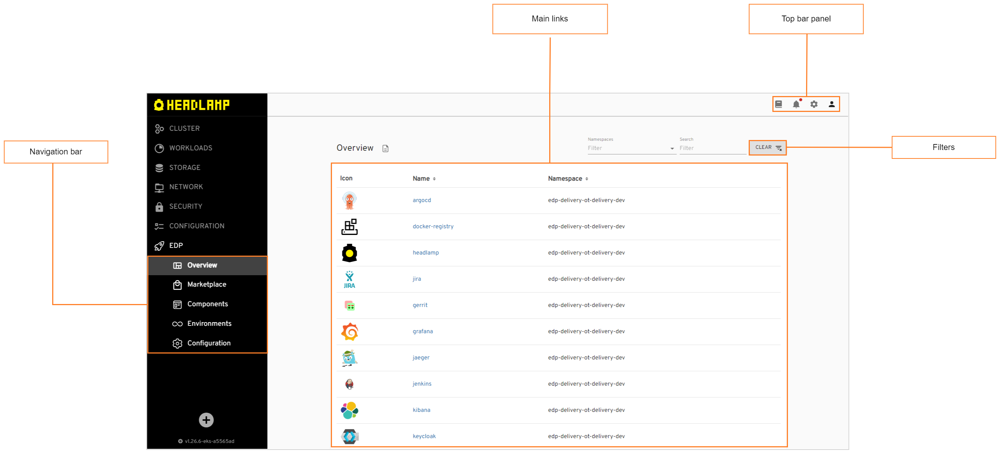

# Overview

The EDP Headlamp user guide is intended for developers and provides details on working with EDP Headlamp, different codebase types, and EDP CI/CD flow.

## Headlamp

Headlamp is a central management tool in the EDP ecosystem that provides the ability to define pipelines, project resources and new technologies in a simple way. Using Headlamp enables to manage business entities:

- Create such codebase types as Applications, Libraries, Autotests and Inrastructures;
- Create/Update CD Pipelines;
- Add external Git servers and Clusters.

!

* **Navigation bar** – consists of the following sections: Overview, Marketplace, Components, CD Pipelines, and Configuration.
* **Top panel bar** – contains documentation link, notifications, Headlamp settings, and cluster settings, such as default and allowed namespaces.
* **Main links** – displays the corresponding links to the major adjusted toolset, to the management tool and to the OpenShift cluster.
* **Filters** – used for searching and filtering the namespaces.

Headlamp is a complete tool allowing to manage and control the codebases (applications, autotests, libraries and infrastructures) added to the environment as well as to create a CD pipeline.

Inspect the main features available in Headlamp by following the corresponding link:

- [Add Application](add-application.md)
- [Add Autotest](add-autotest.md)
- [Add Library](add-library.md)
- [Add Git Server](add-git-server.md)
- [Add CD Pipeline](add-cd-pipeline.md)
- [Add Quality Gate](add-quality-gate.md)
