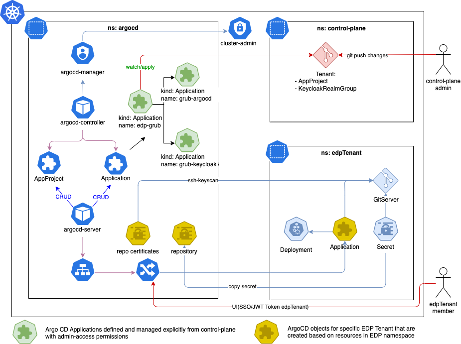

# Argo CD Integration

EDP uses Jenkins Pipeline as a [part of the Continues Delivery/Continues Deployment](../user-guide/cd-pipeline-details.md) implementation. Another approach is to use [Argo CD tool](https://argo-cd.readthedocs.io/en/stable/) as an alternative to Jenkins. Argo CD follows the best GitOps practices, uses Kubernetes native approach for the Deployment Management, has rich UI and required RBAC capabilities.

## Argo CD Deployment Approach in EDP

Argo CD can be installed using [two different approaches](https://argo-cd.readthedocs.io/en/stable/operator-manual/installation):

* Cluster-wide scope with the cluster-admin access
* Namespaced scope with the single namespace access

Both approaches can be deployed with High Availability (HA) or Non High Availability (non HA) installation manifests.

EDP uses the HA deployment with the cluster-admin permissions, to minimize cluster resources consumption by sharing single Argo CD instance across multiple EDP Tenants. Please follow [the installation instructions](./install-argocd.md), to deploy Argo CD.

## EDP Argo CD Integration

See a diagram below for the details:

!

* Argo CD is deployed in a separate `argocd` namespace.
* Argo CD uses a `cluster-admin` role for managing cluster-scope resources.
* The `control-plane` application is created using the App of Apps approach, and its code is managed by the `control-plane` members.
* The `control-plane` is used to onboard new Argo CD Tenants (Argo CD Projects - AppProject).
* The `EDP Tenant Member` manages `Argo CD Applications` using `kind: Application` in the `edpTenant` namespace.

## Configuration

!!! note
      Make sure that both [EDP](./install-edp.md) and [Argo CD are installed](./install-argocd.md), and that SSO is enabled.

To start using Argo CD with EDP, perform the following steps:

1. The [App Of Apps approach](https://argo-cd.readthedocs.io/en/stable/operator-manual/cluster-bootstrapping/) is used to manage the `EDP Tenants`. Inspect the [edp-grub](https://github.com/SergK/edp-grub) repository structure that is used to provide the EDP Tenants for the Argo CD Projects:

    ```bash
    edp-grub
    ├── LICENSE
    ├── README.md
    ├── apps                      ### All Argo CD Applications are stored here
    │   ├── grub-argocd.yaml      # Application that provisions Argo CD Resources - Argo Projects (EDP Tenants)
    │   └── grub-keycloak.yaml    # Application that provisions Keycloak Resources - Argo CD Groups (EDP Tenants)
    ├── apps-configs
    │   └── grub
    │       ├── argocd            ### Argo CD resources definition
    │       │   ├── team-bar.yaml
    │       │   └── team-foo.yaml
    │       └── keycloak          ### Keycloak resources definition
    │           ├── team-bar.yaml
    │           └── team-foo.yaml
    ├── bootstrap
    │   └── root.yaml             ### Root application in App of Apps, which provision Applications from /apps
    └── examples                  ### Examples
        └── tenant
            └── foo-petclinic.yaml
    ```

    The Root Application must be created under the `control-plane` scope.

2. Create an Argo CD Project (EDP Tenant), for example, with the `team-foo` name and a Keycloak Group. Two resources must be created:

    **KeycloakRealmGroup**

    ```yaml
    apiVersion: v1.edp.epam.com/v1
    kind: KeycloakRealmGroup
    metadata:
      name: argocd-team-foo-users
    spec:
      name: ArgoCD-team-foo-users
      realm: main
    ```

    **AppProject**

    ```yaml
    apiVersion: argoproj.io/v1alpha1
    kind: AppProject
    metadata:
      name: team-foo
      namespace: argocd
      # Finalizer that ensures that project is not deleted until it is not referenced by any application
      finalizers:
        - resources-finalizer.argocd.argoproj.io
    spec:
      description: CD pipelines for team-foo
      roles:
        - name: developer
          description: Users for team-foo tenant
          policies:
            - p, proj:team-foo:developer, applications, create, team-foo/*, allow
            - p, proj:team-foo:developer, applications, delete, team-foo/*, allow
            - p, proj:team-foo:developer, applications, get, team-foo/*, allow
            - p, proj:team-foo:developer, applications, override, team-foo/*, allow
            - p, proj:team-foo:developer, applications, sync, team-foo/*, allow
            - p, proj:team-foo:developer, applications, update, team-foo/*, allow
            - p, proj:team-foo:developer, repositories, create, team-foo/*, allow
            - p, proj:team-foo:developer, repositories, delete, team-foo/*, allow
            - p, proj:team-foo:developer, repositories, update, team-foo/*, allow
            - p, proj:team-foo:developer, repositories, get, team-foo/*, allow
          groups:
            # Keycloak Group name
            - ArgoCD-team-foo-users
      destinations:
        # ensure we can deploy to ns with tenant prefix
        - namespace: 'team-foo-*'
        # allow to deploy to specific server (local in our case)
          server: https://kubernetes.default.svc
      # Deny all cluster-scoped resources from being created, except for Namespace
      clusterResourceWhitelist:
      - group: ''
        kind: Namespace
      # Allow all namespaced-scoped resources to be created, except for ResourceQuota, LimitRange, NetworkPolicy
      namespaceResourceBlacklist:
      - group: ''
        kind: ResourceQuota
      - group: ''
        kind: LimitRange
      - group: ''
        kind: NetworkPolicy
      # we are ok to create any resources inside namespace
      namespaceResourceWhitelist:
      - group: '*'
        kind: '*'
      # enable access only for specific git server. The example below 'team-foo' - it is namespace where EDP deployed 
      sourceRepos:
        - ssh://argocd@gerrit.team-foo:30007/*
      # enable capability to deploy objects from namespaces
      sourceNamespaces:
        - team-foo
    ```

3. In Keycloak, add users to the `ArgoCD-team-foo-users` Keycloak Group.

4. Enable argocd controller to manage the Application resources in the specific namespaces (`team-foo`, in our case). Modify the `argocd-cmd-params-cm` configmap in the argocd namespace and add the `application.namespaces` parameter to the subsection data:
   
    **argocd-cmd-params-cm:**

    ```yaml
    data:
      application.namespaces: team-foo
    ```

  The values.yaml file:

    **argocd-deploy-values:**

    ```yaml
    configs:
      params:
        application.namespaces: team-foo
    ```

5. Add a [credential template](https://argo-cd.readthedocs.io/en/stable/user-guide/private-repositories/#private-repositories) for Gerrit integration. The credential template must be created for each EDP tenant (per git server). Deploy test EDP Application with the `demo` name, which is stored in a Gerrit private repository.
    **Application:**

    ```yaml
    apiVersion: argoproj.io/v1alpha1
    kind: Application
    metadata:
      name: demo
    spec:
      project: team-foo
      destination:
        namespace: team-foo-demo
        server: https://kubernetes.default.svc
      source:
        helm:
          parameters:
            - name: image.tag
              value: master-0.1.0-1
            - name: image.repository
              value: image-repo
        path: deploy-templates
        repoURL: ssh://argocd@gerrit.team-foo:30007/demo.git
        targetRevision: master
      syncPolicy:
        syncOptions:
          - CreateNamespace=true
        automated:
          selfHeal: true
          prune: true
    ```

6. Check that your new Repository and Application are added to the Argo CD UI under the `team-foo` Project scope.

## Related Articles

* [Install Argo CD](install-argocd.md)