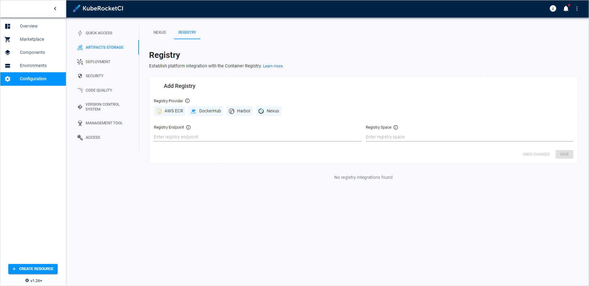
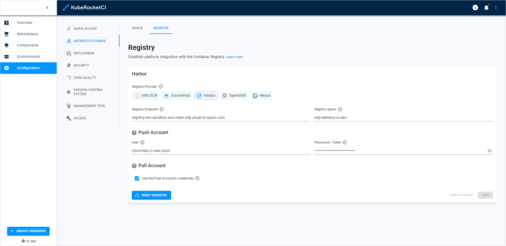
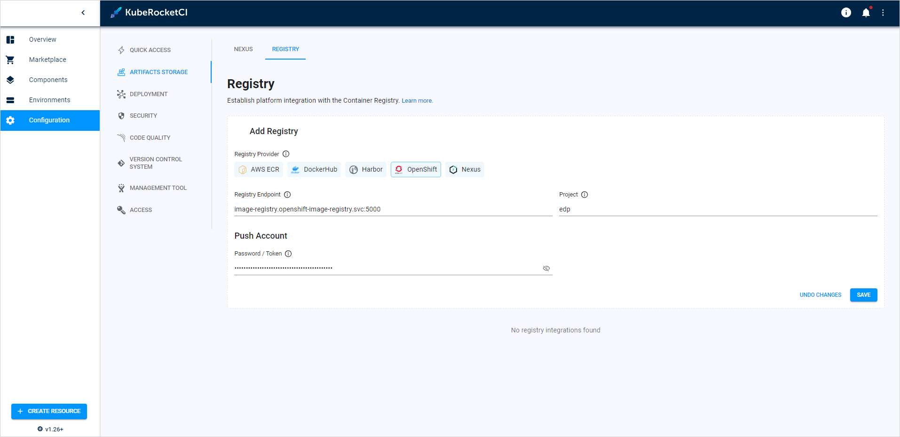
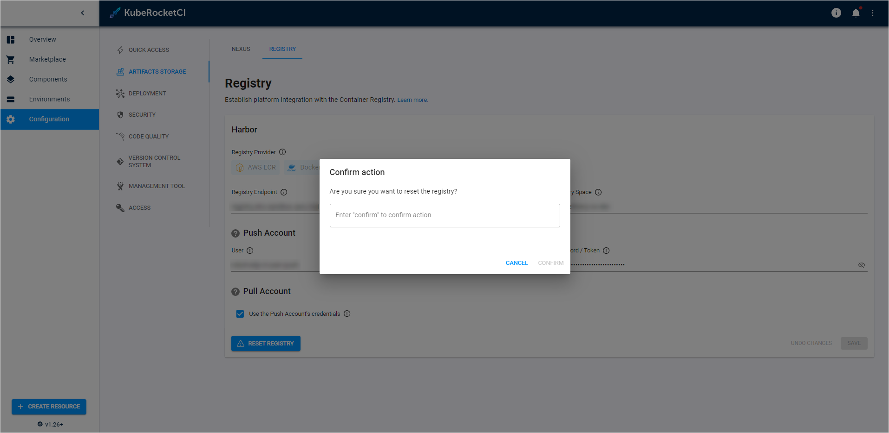

# Container Registry Overview

Container registry is a prerequisite for using the platform, so it is crucial to know how to integrate EDP with various container registries.
This guide outlines the steps required for the integration of the container registry with the EPAM Delivery Platform.

## Supported Registry Providers

The table below illustrates the registry services supported for OpenShift and Kubernetes clusters.

|Container Registry|OpenShift|Kubernetes|
|:-:|:-:|:-:|
|AWS ECR|+|+|
|DockerHub|+|+|
|Harbor|+|+|
|OpenShift (OCR)|+|-|

## Add Container Registry

The process of integrating a container registry in EDP consists of three steps:

  1. In the `EDP Portal` main menu, navigate to `EDP` -> `Configuration` -> `Registry`:

   !

  2. Select `Registry Provider` and enter the required details.

  3. Confirm settings by clicking the `Save` button.

The required fields vary depending on which container registry is chosen:

=== "AWS ECR"

      !

      |Fields|Description|
      |:-|:-|
      |Registry Endpoint|Format for the (AWS) Elastic Container Registry endpoint: xxxxxxxxxxxx.dkr.ecr.<region>.amazonaws.com. Where `xxxxxxxxxxxx` is your AWS account ID and `<region>` is where your ECR is hosted.|
      |Registry Space|The suffix project name in registry.|
      |AWS Region| The geographic area where the (AWS) Elastic Container Registry repository is hosted.|
      |Authentication/IRSA Role ARN|Specify the [IAM role](https://docs.aws.amazon.com/AmazonECR/latest/userguide/repository-policies.html) with a policy for interacting with ECR with your Kubernetes cluster.

=== "DockerHub"

      !

      |Fields|Description|
      |:-|:-|
      |Registry Space|The unique identifier/name of the user or company linked to your DockerHub account.|
      |User|The user account id or community user account id with push permission.|
      |Password/Token|Provide the [Password/Token](https://docs.docker.com/security/for-developers/access-tokens/) corresponding to your docker hub account. It is recommended to use Token for security purposes.|
      |Checkbox/Use the Push Account's credentials|Check this to use the same account for pulling and pushing operations. If unchecked, please enter the user account id and Password/Token for your DockerHub account or community user account id with pull permission.|

=== "Harbor"

      !

      |Fields|Description|
      |:-|:-|
      |Registry Endpoint|Enter Harbor registry endpoint URL, for example, registry.example.com.|
      |Registry Space|The project name in registry.|
      |User|Provide the [robot account](container-registry-harbor-integration-tekton-ci.md/#set-up-robot-account) name with with push permissions.|
      |Password/Token|Provide the [secret](container-registry-harbor-integration-tekton-ci.md/#set-up-robot-account) corresponding to your harbor account.|
      |Checkbox/Use the Push Account's credentials|Check this to use the same account for pulling and pushing operations. Provide the robot account name with with pull permissions.|

=== "OpenShift"

      !

      |Fields|Description|
      |:-|:-|
      |Registry Endpoint|OpenShift service registry endpoint URL (e.g., image-registry.openshift-image-registry.svc:5000).|
      |Project|The project name in registry.|
      |Password/Token|Supply the [password](https://docs.openshift.com/container-platform/4.2/authentication/identity_providers/configuring-htpasswd-identity-provider.html#identity-provider-htpasswd-update-users_configuring-htpasswd-identity-provider) for the user who has pull authorization privileges in your OpenShift container image registry.|

## Remove Container Registry

To remove container registry integration from EDP, follow the steps below:

!!! warning
    Proceed with caution, removing registry settings might disrupt your CI/CD process.

  1. In the `EDP Portal` main menu, navigate to `EDP` -> `Configuration` -> `Registry`.

  2. Click the `Reset registry` button, type the `confirm` word and then click `Confirm`:

  !

## Related Articles

* [Install EDP](install-edp.md)
* [Install Harbor](install-harbor.md)
