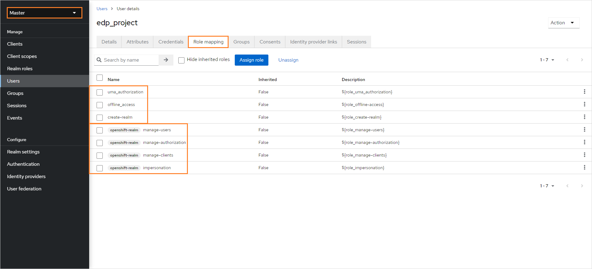

# EKS OIDC Integration

This page is a detailed guide on integrating Keycloak with the edp-keycloak-operator to serve as an identity provider for AWS Elastic Kubernetes Service (EKS). It provides step-by-step instructions for creating necessary realms, users, roles, and client configurations for a seamless Keycloak-EKS collaboration. Additionally, it includes guidelines on installing the edp-keycloak-operator using Helm charts.

## Prerequisites

* [EKS Configuration](https://epam.github.io/edp-install/operator-guide/configure-keycloak-oidc-eks/?h=oidc#eks-configuration) is performed;
* [Helm v3.10.0](https://github.com/helm/helm/releases/tag/v3.10.0) is installed;
* [Keycloak](../operator-guide/install-keycloak.md) is installed.

## Configure Keycloak

To prepare Keycloak for integration with the edp-keycloak-operator, follow the steps below:

1. Ensure that the **openshift** realm is created.

2. Create the **orchestrator** user and set the password in the **Master** realm.

3. In the **Role Mapping** tab, assign the proper roles to the user:

  * Realm Roles:

    * create-realm;

    * offline_access;

    * uma_authorization.

  * Client Roles `openshift-realm`:

    * impersonation;

    * manage-authorization;

    * manage-clients;

    * manage-users.

!

## Install Keycloak Operator

To install the Keycloak operator, follow the steps below:

1. Add the `epamedp` Helm chart to a local client:

  ```bash
  helm repo add epamedp https://epam.github.io/edp-helm-charts/stable
  helm repo update
  ```

2. Install the Keycloak operator:

  ```bash
  helm install keycloak-operator epamedp/keycloak-operator --namespace security --set name=keycloak-operator
  ```

## Connect Keycloak Operator to Keycloak

The next stage after installing Keycloak is to integrate it with the Keycloak operator. It can be implemented with the following steps:

1. Create the **keycloak** secret that will contain username and password to perform the integration. Set your own password. The username must be **orchestrator**:

  ```bash
  kubectl -n security create secret generic keycloak \
    --from-literal=username=orchestrator \
    --from-literal=password=<password>
  ```

2. Create the Keycloak Custom Resource with the Keycloak instance URL and the secret created in the previous step:

  ```yaml
  apiVersion: v1.edp.epam.com/v1
  kind: Keycloak
  metadata:
    name: main
    namespace: security
  spec:
    secret: keycloak                   # Secret name
    url: https://keycloak.example.com  # Keycloak URL
  ```

3. Create the KeycloakRealm Custom Resource:

    ```yaml
    apiVersion: v1.edp.epam.com/v1
    kind: KeycloakRealm
    metadata:
      name: control-plane
      namespace: security
    spec:
      realmName: control-plane
      keycloakOwner: main
    ```

4. Create the KeycloakRealmGroup Custom Resource for both administrators and developers:

  === "administrators"
      ```yaml
      apiVersion: v1.edp.epam.com/v1
      kind: KeycloakRealmGroup
      metadata:
        name: administrators
        namespace: security
      spec:
        realm: control-plane
        name: eks-oidc-administrator
      ```

  === "developers"
      ```yaml
      apiVersion: v1.edp.epam.com/v1
      kind: KeycloakRealmGroup
      metadata:
        name: developers
        namespace: security
      spec:
        realm: control-plane
        name: eks-oidc-developers
      ```

5. Create the KeycloakClientScope Custom Resource:

    ```yaml
    apiVersion: v1.edp.epam.com/v1
    kind: KeycloakClientScope
    metadata:
      name: groups-keycloak-eks
      namespace: security
    spec:
      name: groups
      realm: control-plane
      description: "Group Membership"
      protocol: openid-connect
      protocolMappers:
        - name: groups
          protocol: openid-connect
          protocolMapper: "oidc-group-membership-mapper"
          config:
            "access.token.claim": "true"
            "claim.name": "groups"
            "full.path": "false"
            "id.token.claim": "true"
            "userinfo.token.claim": "true"
    ```

6. Create the KeycloakClient Custom Resource:

    ```yaml
    apiVersion: v1.edp.epam.com/v1
    kind: KeycloakClient
    metadata:
      name: eks
      namespace: security
    spec:
      advancedProtocolMappers: true
      clientId: eks
      directAccess: true
      public: false
      defaultClientScopes:
        - groups
      targetRealm: control-plane
      webUrl: "http://localhost:8000"
    ```

7. Create the KeycloakRealmUser Custom Resource for both administrator and developer roles:

  === "administrator role"

      ``` yaml
      apiVersion: v1.edp.epam.com/v1
      kind: KeycloakRealmUser
      metadata:
        name: keycloakrealmuser-sample
        namespace: security
      spec:
        realm: control-plane
        username: "administrator"
        firstName: "John"
        lastName: "Snow"
        email: "administrator@example.com"
        enabled: true
        emailVerified: true
        password: "12345678"
        keepResource: true
        requiredUserActions:
          - UPDATE_PASSWORD
        groups:
          - eks-oidc-administrator
      ```

  === "developer role"

      ``` yaml
      apiVersion: v1.edp.epam.com/v1
      kind: KeycloakRealmUser
      metadata:
        name: keycloakrealmuser-sample
        namespace: security
      spec:
        realm: control-plane
        username: "developers"
        firstName: "John"
        lastName: "Snow"
        email: "developers@example.com"
        enabled: true
        emailVerified: true
        password: "12345678"
        keepResource: true
        requiredUserActions:
          - UPDATE_PASSWORD
        groups:
          - eks-oidc-developers
      ```

8. As a result, Keycloak is integrated with the AWS Elastic Kubernetes Service. This integration enables users to log in to the EKS cluster effortlessly using their kubeconfig files while managing permissions through Keycloak.

## Related Articles

* [Keycloak Installation](install-keycloak.md)
* [EKS OIDC With Keycloak](configure-keycloak-oidc-eks.md)
