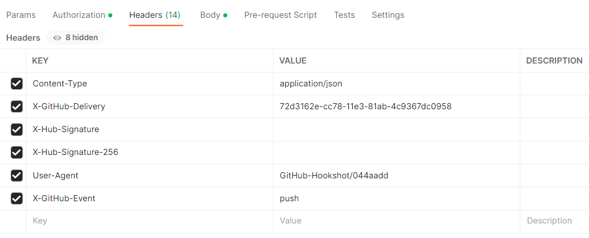
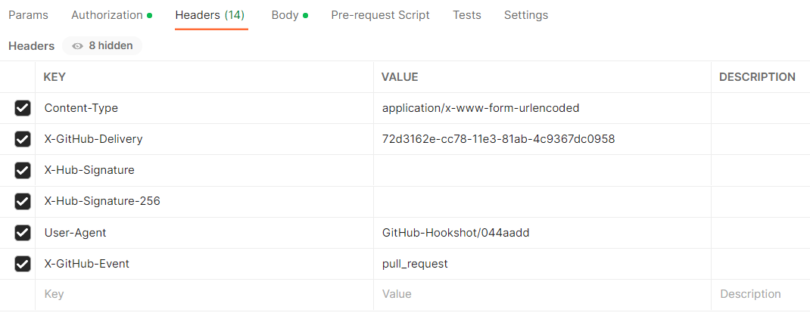
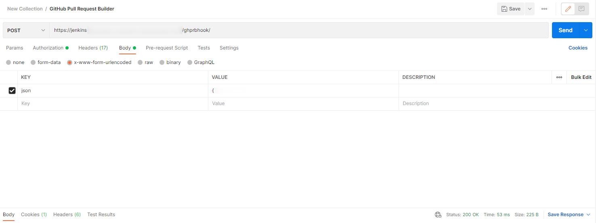

# Debug GitHub Webhooks in Jenkins

A webhook enables third-party services like GitHub to send real-time updates to an application. Updates are triggered by an event or an action by the webhook provider (for example, a push to a repository, a Pull Request creation), and pushed to the application via HTTP requests, namely, Jenkins.<br>
The GitHub Jenkins job provisioner creates a webhook in the GitHub repository during the **Create release** pipeline once the [VCS Import Strategy](import-strategy.md) is enabled and the [GitHub Integration](github-integration.md) is completed.

The Jenkins setup in EDP uses the following plugins responsible for listening on GitHub webhooks:

* [GitHub](https://plugins.jenkins.io/github/) plugin is configured to listen on Push events.

* [GitHub Pull Request Builder](https://plugins.jenkins.io/ghprb/) is configured to listen on Pull Request events.

In case of any issues with webhooks, try the following solutions:

1. Check that the firewalls are configured to accept the incoming traffic from the IP address range that is described in the [GitHub documentation](https://docs.github.com/en/authentication/keeping-your-account-and-data-secure/about-githubs-ip-addresses).

2. Check that GitHub **Personal Access Token** is correct and has sufficient scope permissions.

3. Check that the job has run at least once before using the hook (once an application is created in EDP, the build job should be run automatically in Jenkins).

4. Check that both _Push_ and _issue comment_ and _Pull Request_ webhooks are created on the GitHub side (unlike GitLab, GitHub does not need separate webhooks for each branch):
  * Go to the GitHub repository -> **Settings** -> **Webhooks**.

  !

5. Click each webhook and check if the event delivery is successful:
  * The URL payload must be `https://jenkins-the-host.com/github-webhook/` for the GitHub plugin and `https://jenkins-the-host.com/ghprbhook/` for the GitHub Pull Request Builder.
  * The content type must be *application/json* for Push events and *application/x-www-form-urlencoded* for Pull Request events.
  * The *html_url* in the **Payload** request must match the repository URL and be without *.git* at the end of the URL.

6. Check that the **X-Hub-Signature** secret is verified. It is provided by the [Jenkins GitHub plugin](https://plugins.jenkins.io/github/) for Push events and by the [GitHub Pull Request Builder plugin](https://plugins.jenkins.io/ghprb/) for Pull Request events. The **Secret** field is optional. Nevertheless, if incorrect, it can prevent webhook events.

  For the GitHub plugin (Push events):

  * Go to **Jenkins** -> **Manage Jenkins** -> **Configure System**, and find the **GitHub plugin** section.
  * Select **Advanced** -> **Shared secrets** to add the secret via the Jenkins Credentials Provider.

  For the GitHub Pull Request Builder (Pull Request events):

  * Go to **Jenkins** -> **Manage Jenkins** -> **Configure System**, and find the **GitHub Pull Request Builder plugin** section.
  * Check **Shared secret** that can be added manually.

7. Redeliver events by clicking the **Redeliver** button and check the **Response** body.

  !

  !!! Note
      Use Postman to debug webhooks.<br>
      Add all headers to Postman from the webhook **Request** -> **Headers** field and send the payload (**Request body**) using the appropriate content type.<br>

  Examples for Push and Pull Request [events](https://docs.github.com/en/developers/webhooks-and-events/webhooks/webhook-events-and-payloads):

  !
  !

  The response in the Jenkins log:

  ```
  Jan 17, 2022 8:51:14 AM INFO org.jenkinsci.plugins.github.webhook.subscriber.PingGHEventSubscriber onEvent
  PING webhook received from repo <https://github.com/user-profile/user-repo>!
  ```

  !
  !

  The response in the Jenkins log:

  ```
  Jan 17, 2022 8:17:53 AM FINE org.jenkinsci.plugins.ghprb.GhprbRootAction
  Got payload event: ping
  ```

8. Check that the repo pushing to Jenkins, the GitHub project URL in the project configuration, and the repos in the pipeline Job must be lined up.

9. Enable the **GitHub hook trigger for GITScm polling** for the Build job.

  !

10. Enable the **GitHub Pull Request Builder** for the Code Review job.

  !

11. Filter through Jenkins log by using Jenkins custom log recorder:
  * Go to **Manage Jenkins** -> **System log** -> **Add new log recorder**.
  * The Push events for the GitHub:

    | Logger | Log Level |
    | ------ | --------- |
    | org.jenkinsci.plugins.github.webhook.subscriber.DefaultPushGHEventSubscriber | ALL |
    | com.cloudbees.jenkins.GitHubPushTrigger | ALL |
    | com.cloudbees.jenkins.GitHubWebHook | ALL |
    | org.jenkinsci.plugins.github.webhook.WebhookManager | ALL |
    | org.jenkinsci.plugins.github.webhook.subscriber.PingGHEventSubscriber | ALL |

  * The Pull Request events for the GitHub Pull Request Builder:

    | Logger | Log Level |
    | ------ | --------- |
    | org.jenkinsci.plugins.ghprb.GhprbRootAction | ALL |
    | org.jenkinsci.plugins.ghprb.GhprbTrigger | ALL |
    | org.jenkinsci.plugins.ghprb.GhprbPullRequest | ALL |
    | org.jenkinsci.plugins.ghprb.GhprbRepository | ALL |

  !!! Note
      Below is an example of using the *Pipeline script* with webhooks for the GitHub plugin implemented in the EDP pipelines:

          properties([pipelineTriggers([githubPush()])])

          node {
              git credentialsId: 'github-sshkey', url: 'https://github.com/someone/something.git', branch: 'master'
          }

      Push events may not work correctly with the Job *Pipeline script from SCM* option in the current version of the GitHub plugin 1.34.1.

### Related Articles

* [GitHub Webhooks](https://docs.github.com/en/developers/webhooks-and-events/webhooks)
* [Enable VCS Import Strategy](import-strategy.md)
* [GitHub Integration](github-integration.md)
* [Manage Jenkins CI Pipeline Job Provision](manage-jenkins-ci-job-provision.md)
* [GitHub plugin](https://plugins.jenkins.io/github/)
* [GitHub Pull Request Builder](https://plugins.jenkins.io/ghprb/)