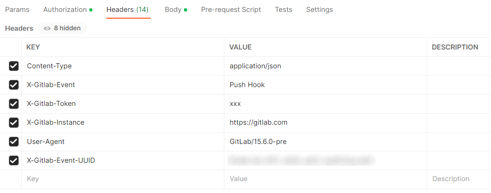
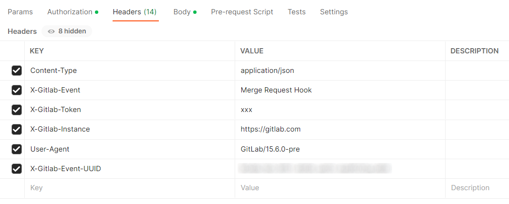

# Debug GitLab Webhooks in Jenkins

A webhook enables third-party services like GitLab to send real-time updates to the application. Updates are triggered by an event or action by the webhook provider (for example, a push to a repository, a Merge Request creation), and pushed to the application via the HTTP requests, namely, Jenkins.<br>
The GitLab Jenkins job provisioner creates a webhook in the GitLab repository during the **Create release** pipeline once the [Integrate GitHub/GitLab in Jenkins](../operator-guide/import-strategy-jenkins.md) is enabled and the [GitLab Integration](gitlab-integration.md) is completed.

The Jenkins setup in EDP uses the [GitLab](https://plugins.jenkins.io/gitlab-plugin/) plugin responsible for listening on GitLab webhook Push and Merge Request events.

In case of any issues with webhooks, try the following solutions:

1. Check that the firewalls are configured to accept incoming traffic from the IP address range that is described in the [GitLab documentation](https://docs.gitlab.com/ee/user/gitlab_com/#ip-range).

2. Check that GitLab Personal Access Token is correct and has the *api* scope. If you have used the Project Access Token, make sure that the role is *Owner* or *Maintainer*, and it has the *api* scope.

3. Check that the job has run at least once before using the hook (once an application is created in EDP, the build job should be run automatically in Jenkins).

4. Check that both _Push Events, Note Events_ and _Merge Requests Events, Note Events_ webhooks are created on the GitLab side for each branch (unlike GitHub, GitLab must have separate webhooks for each branch).
  * Go to the **GitLab repository** -> **Settings** -> **Webhooks**:

  !

5. Click **Edit** next to each webhook and check if the event delivery is successful. If the webhook is sent, the **Recent Deliveries** list becomes available. Click **View details**.

  !

  * The URL payload must be similar to the job URL on Jenkins. For example:<br>
  `https://jenkins-server.com/project/project-name/MAIN-Build-job` is for the Push events.<br>
  `https://jenkins-server.com/project/project-name/MAIN-Code-review-job` is for the Merge Request events.
  * The content type must be *application/json* for both events.
  * The *"web_url"* in the **Request body** must match the repository URL.
  * Project *"web_url"*, *"path_with_namespace"*, *"homepage"* links must be without *.git* at the end of the URL.

6. Verify the **Secret token** (**X-Gitlab-Token**). This [token](https://docs.gitlab.com/ee/integration/jenkins.html#configure-a-webhook) comes from the Jenkins job due to the Jenkins GitLab Plugin and is created by our Job Provisioner:
  * Go to the Jenkins job and select **Configure**.
  * Select **Advanced** under the **Build Triggers** and check the **Secret token**.

  **Secret token** is optional and can be empty. Nevertheless, if incorrect, it can prevent webhook events.

7. Redeliver events by clicking the **Resend Request** button and check the **Response** body.

  !!! Note
      Use Postman to debug webhooks.<br>
      Add all headers to Postman from the webhook **Request Headers** field and send the payload (**Request body**) using the appropriate content type.<br>

   Examples for Push and Merge Request [events](https://docs.gitlab.com/ee/user/project/integrations/webhook_events.html):

  !
  !

  The response in the Jenkins log:

  ```
  Jan 17, 2022 11:26:34 AM INFO com.dabsquared.gitlabjenkins.webhook.GitLabWebHook getDynamic
  WebHook call ed with url: /project/project-name/MAIN-Build-job
  Jan 17, 2022 11:26:34 AM INFO com.dabsquared.gitlabjenkins.trigger.handler.AbstractWebHookTriggerHandler handle
  project-name/MAIN-Build-job triggered for push.
  ```

  !
  !

  The response in the Jenkins log:

  ```
  Jan 17, 2022 11:14:58 AM INFO com.dabsquared.gitlabjenkins.webhook.GitLabWebHook getDynamic
  WebHook called with url: /project/project-name/MAIN-Code-review-job
  ```

8. Check that the repository pushing to Jenkins and the repository(ies) in the pipeline Job are lined up. **GitLab Connection** must be defined in the job settings.

9. Check that the settings in the **Build Triggers** for the Build job are as follows:

  !

10. Check that the settings in the **Build Triggers** for the Code Review job are as follows:

  !

11. Filter through Jenkins log by using Jenkins custom log recorder:
  * Go to **Manage Jenkins** -> **System Log** -> **Add new log recorder**.
  * The Push and Merge Request events for the GitLab:

    | Logger | Log Level |
    | ------ | --------- |
    | com.dabsquared.gitlabjenkins.webhook.GitLabWebHook | ALL |
    | com.dabsquared.gitlabjenkins.trigger.handler.AbstractWebHookTriggerHandler | ALL |
    | com.dabsquared.gitlabjenkins.trigger.handler.merge.MergeRequestHookTriggerHandlerImpl | ALL |
    | com.dabsquared.gitlabjenkins.util.CommitStatusUpdater | ALL |

### Related Articles

* [GitLab Webhooks](https://docs.gitlab.com/ee/user/project/integrations/webhooks.html)
* [Integrate GitHub/GitLab in Jenkins](../operator-guide/import-strategy-jenkins.md)
* [Integrate GitHub/GitLab in Tekton](../operator-guide/import-strategy-tekton.md)
* [Jenkins Integration With GitLab](https://docs.gitlab.com/ee/integration/jenkins.html)
* [GitLab Integration](gitlab-integration.md)
* [Manage Jenkins CI Pipeline Job Provision](manage-jenkins-ci-job-provision.md)
* [GitLab Plugin](https://plugins.jenkins.io/gitlab-plugin/)
