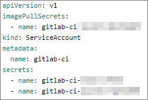

# Adjust GitLab CI Tool

EDP allows selecting one of two available CI (Continuous Integration) tools, namely: Jenkins or GitLab.
The Jenkins tool is available by default. To use the GitLab CI tool, it is required to make it available first.

Follow the steps below to adjust the GitLab CI tool:

1. In GitLab, add the environment variables to the project.

  * To add variables, navigate to *Settings -> CI/CD -> Expand Variables -> Add Variable*:

    

  * Apply the necessary variables as they differ in accordance with the cluster OpenShift / Kubernetes, see below:

    |OpenShift Environment Variables | Description|
    |---|---|
    |DOCKER_REGISTRY_URL| URL to OpenShift docker registry|
    |DOCKER_REGISTRY_PASSWORD| Service Account token that has an access to registry|
    |DOCKER_REGISTRY_USER| user name|
    |OPENSHIFT_SA_TOKEN| token that can be used to log in to OpenShift|

    !!! info
      In order to get access to the Docker registry and OpenShift, use the **gitlab-ci** ServiceAccount; pay attention that SA description contains the credentials and secrets:

    

    |Kubernetes Environment Variables | Description|
    |---|---|
    |DOCKER_REGISTRY_URL| URL to Amazon ECR|
    |AWS_ACCESS_KEY_ID| auto IAM user access key|
    |AWS_SECRET_ACCESS_KEY| auto IAM user secret access key|
    |K8S_SA_TOKEN| token that can be used to log in to Kubernetes|

    !!! note
        To get the access to ECR, it is required to have an auto IAM user that has rights to push/create a repository.

2. In Admin Console, select the CI tool in the **Advanced Settings** menu during the codebase creation:

  

  !!! note
      The selection of the CI tool is available only with the **Import** strategy.

3. As soon as the codebase is provisioned, the **.gitlab-ci.yml** file will be created in the repository that describes the
pipeline's stages and logic:

  
