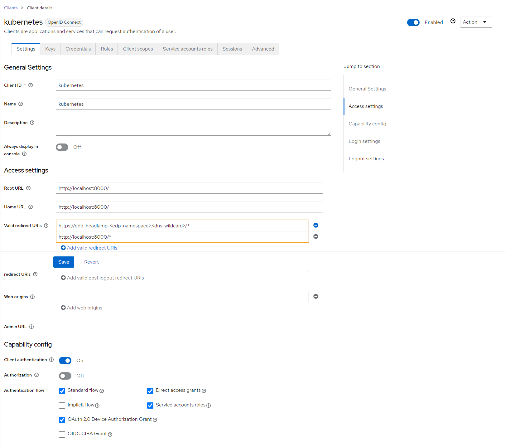

# Headlamp OIDC Configuration

This page provides the instructions of configuring the [OIDC authorization](https://openid.net/connect/) for
[EDP Portal UI](../user-guide/index.md), thus allowing using SSO for authorization in Portal and controlling
user access and rights from one configuration point.

## Prerequisites

Ensure the following values are set first before starting the Portal OIDC configuration:

1. `realm_id`  = **openshift**

2. `client_id` = **kubernetes**

3. `keycloak_client_key`= **keycloak_client_secret_key** (received from: `Openshift realm` -> `clients` -> `kubernetes` -> `Credentials` -> `Client secret`)

4. `group` = **`edp-oidc-admins`, `edp-oidc-builders`, `edp-oidc-deployers`, `edp-oidc-developers`, `edp-oidc-viewers`** (Should be created manually in the realm from point 1)

!!! note
    The values indicated above are the result of the Keycloak configuration as an OIDC identity provider.
    To receive them, follow the instructions on the [Keycloak OIDC EKS Configuration](configure-keycloak-oidc-eks.md) page.

## Configure Keycloak

To proceed with the Keycloak configuration, perform the following:

1. Add the URL of the Headlamp to the `valid_redirect_uris` variable in [Keycloak](configure-keycloak-oidc-eks.md#keycloak_client):

  ??? note "View: keycloak_openid_client"
      ```yaml
        valid_redirect_uris = [
          "https://edp-headlamp-edp.<dns_wildcard>/*"
          "http://localhost:8000/*"
        ]
      ```

  Make sure to define the following Keycloak client values as indicated:

  !

2. Configure the Keycloak client key in Kubernetes using the Kubernetes secrets or the [External Secrets Operator](external-secrets-operator-integration.md):

  ```yaml
  apiVersion: v1
  kind: Secret
  metadata:
    name: keycloak-client-headlamp-secret
    namespace: edp
  type: Opaque
  stringData:
    clientSecret: <keycloak_client_secret_key>
  ```

3. Assign user to one or more groups in Keycloak.

## Integrate Headlamp With Kubernetes

Headlamp can be integrated in Kubernetes in three steps:

1. Update the [values.yaml](install-edp.md#values) file by enabling OIDC:

  ??? note "View: values.yaml"
      ```yaml
      edp-headlamp:
        config:
          oidc:
            enabled: true
      ```

2. Navigate to Headlamp and log in by clicking the `Sign In` button:

  !

3. Go to `EDP` section -> `Account` -> `Settings`, and set up a namespace:

  !

As a result, it is possible to control access and rights from the Keycloak endpoint.

## Related Articles

* [Configure Access Token Lifetime](../faq.md#how-to-change-the-lifespan-of-an-access-token-that-is-used-for-headlamp-and-oidc-login-plugin)
* [EKS OIDC With Keycloak](configure-keycloak-oidc-eks.md)
* [External Secrets Operator](external-secrets-operator-integration.md)
