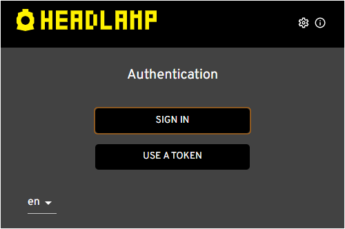

# Headlamp OIDC Configuration

This page provides the instructions of configuring the  [OIDC authorization](https://openid.net/connect/) for [EDP Headlamp UI](../headlamp-user-guide/index.md), thus allowing using SSO for authorization in Headlamp, control of user access and rights from one configuration point.

## Prerequisites

Before starting the Headlamp OIDC configuration, first, make sure to have the following values:

1. `realm_id`  = **openshift**

2. `client_id` = **kubernetes**

3. `keycloak_client_key`= **keycloak_client_secret_key** (received from: `Openshift realm` -> `clients` -> `kubernetes` -> `Credentials` -> `Client secret`)

4. `group` = **kubernetes-oidc-admins**

!!! note
    The values indicated above are the result of the Keycloak configuration as an OIDC identity provider. To receive them, follow the instructions on the [Keycloak OIDC EKS Configuration](configure-keycloak-oidc-eks.md) page.

## Configure Keycloak

To proceed with the Keycloak configuration, perform the following:

1. Add the URL of the Headlamp to the `valid_redirect_uris` variable in [Keycloak](configure-keycloak-oidc-eks.md#keycloak_client):

  ??? note "View: keycloak_openid_client"
      ```yaml
        valid_redirect_uris = [
          "https://edp-headlamp-<edp_namespace>.<dns_wildcard>/*"
          "http://localhost:8000/*"
        ]
      ```

  - Make sure to define the following Keycloak client values as indicated:

  !

2. Configure the Keycloak client key in Kubernetes using the Kubernetes secrets or the [External Secrets Operator](external-secrets-operator-integration.md):

  ```yaml
  apiVersion: v1
  kind: Secret
  metadata:
    name: keycloak-client-headlamp-secret
    namespace: <edp-project>
  type: Opaque
  stringData:
    clientSecret: <keycloak_client_secret_key>
  ```

3. Assign user in the `kubernetes-oidc-admins` group.

## Integrate Headlamp With Kubernetes

Follow the steps below to integrate Headlamp OIDC with Kubernetes

1. Create ClusterRole and RoleBinding in Kubernetes:

  !!! note
      The role binding provides access to all resources in the current namespace. The Cluster Role can be customized to define the resources.

  In the example below, we use the 'cluster-admin' cluster role with the namespace scope:

  ```yaml
  apiVersion: rbac.authorization.k8s.io/v1
  kind: RoleBinding
  metadata:
    name: headlamp-tenant-admin
    namespace: <edp-project>
  roleRef:
    apiGroup: rbac.authorization.k8s.io
    kind: ClusterRole
    name: cluster-admin
  subjects:
    - apiGroup: rbac.authorization.k8s.io
      kind: Group
      name: "kubernetes-oidc-admins"
  ```


2. Update the [values.yaml](install-edp.md#values) file:

  ??? note "View: values.yaml"
      ```yaml
      edp-headlamp:
        config:
          oidc:
            enabled: true
      ```

4. Navigate to Headlamp and log in by clicking the Sign In button:

  !

5. Go to EDP section -> Account -> Settings, and set up a namespace:

  !

As a result, it is possible to control access and rights from the Keycloak endpoint.

## Related Articles

* [Configure Access Token Lifetime](../faq.md#how-to-change-the-lifespan-of-an-access-token-that-is-used-for-headlamp-and-oidc-login-plugin)
* [EKS OIDC With Keycloak](configure-keycloak-oidc-eks.md)
* [External Secrets Operator](external-secrets-operator-integration.md)