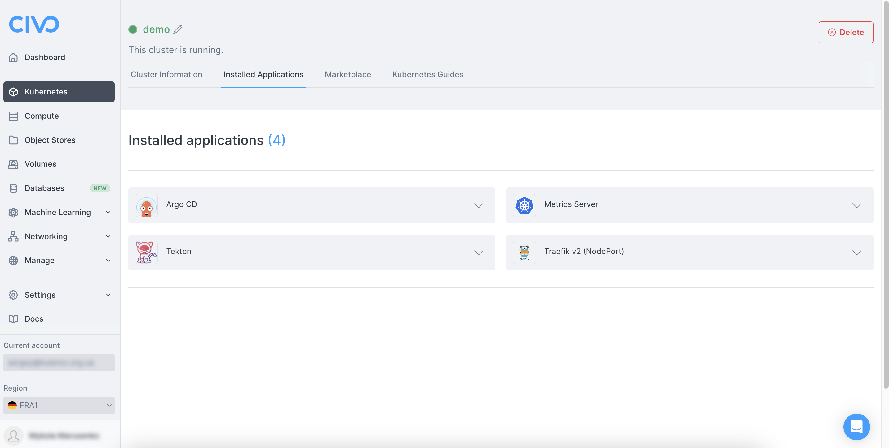
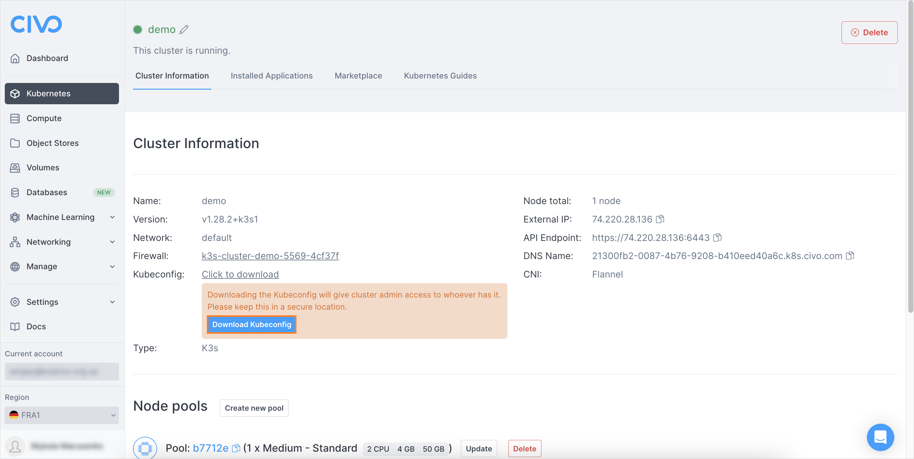
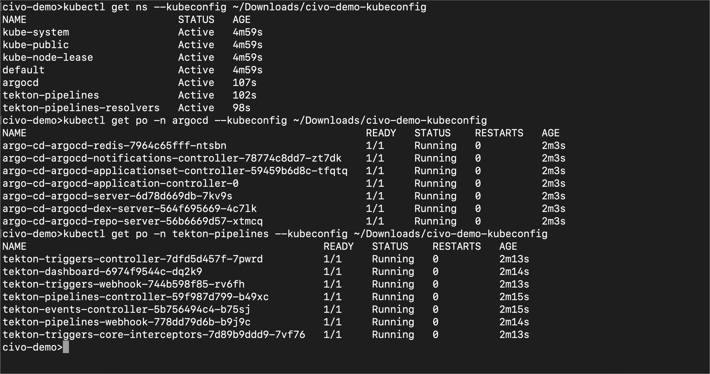
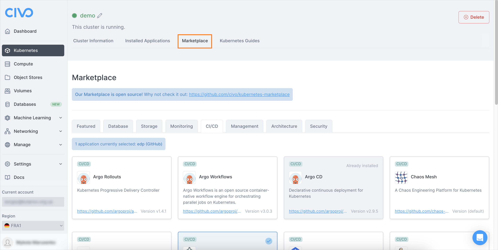
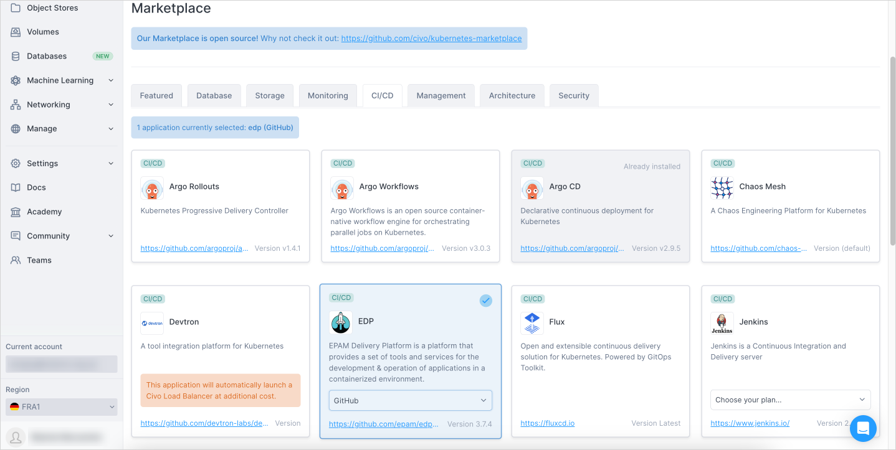
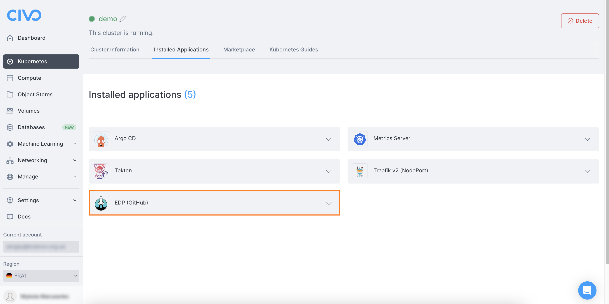
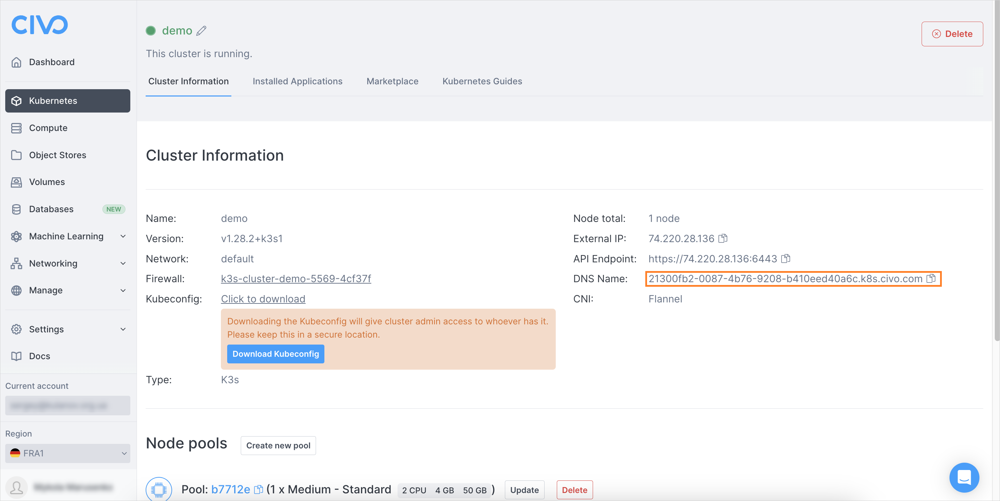
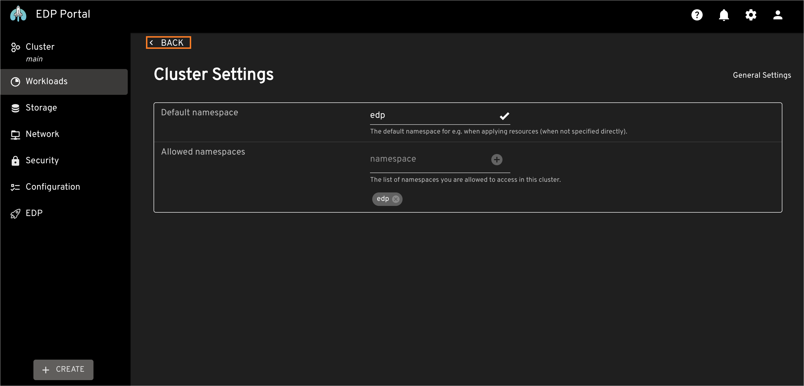

# Install EDP with Civo

This documentation provides the detailed instructions on how to install the EPAM Delivery Platform via [Civo Marketplace](https://www.civo.com/marketplace/edp). As a prerequisite, ensure to [sign up](https://dashboard.civo.com/signup) in Civo.

## Launch cluster

The first step of the installation procedure is to launch the cluster. Please refer to the [official instructions](https://www.civo.com/docs/kubernetes/create-a-cluster) that describe this process in detail. To succeed, follow the steps below:

1. Log in to the personal account.

2. Create a new Kubernetes cluster with the parameters below. Please refer to the [official guidelines](https://www.civo.com/docs/kubernetes/create-a-cluster) for more details:

  * **Name**: `demo`
  * **How many nodes**: 1
  * **Select size**: Type: Standard, Size: Medium
  * **Network**: Default
  * **Firewall**: Create a new firewall with the 443 and 6443 ports opened
  * **Advanced options**: Kubernetes version: latest (currently 1.28.2)
  * **Marketplace**: Choose the Argo CD and Tekton stacks

3. Wait till the cluster is created.

  !!! note
      The cluster deployment takes around two minutes. After cluster deployment, additional 5 minutes are required for both Argo CD and Tekton stacks to get deployed.

4. As soon as cluster is deployed, ensure all the marketplace applications are installed, too:

  !

5. Download and apply the kubeconfig file:

  !

6. Ensure all the pods are up and running in both the Tekton and Argo CD namespaces after 5 minutes of waiting. Restart deployments if the pods are failed to deploy:

      kubectl get ns
      kubectl get pods -n tekton-pipelines
      kubectl get pods -n argocd

  !

## Install EDP

As soon as the cluster is deployed, it is time to install the EDP application.

1. In the Civo portal, navigate to **Marketplace** -> **CI/CD**:

  !

2. Select EDP and choose which Version Control Systems you would prefer to integrate it with and click the **Install Apps** button:

  !

3. Wait till the EDP app appears in the **Installed applications** list:

  !

4. Wait till all the pods are up and running. Use the `kubectl get pods` command to check the status of the pods:

      kubectl get pods -n edp

  !

5. As soon as all the pods are deployed. Navigate to the **Cluster Information** tab and copy the DNS name:

  !

6. In the new browser tab, access the EDP Portal UI by typing the URL according to the `https://edp-headlamp-edp.<DNS_name>` format.

7. Accept the security warning and click the **service access token** link to open the [instructions](https://headlamp.dev/docs/latest/installation/#create-a-service-account-token) on how to get a token to log in to the EDP Portal UI.

8. As soon as the token is created, paste it in the **ID token** field and click the **Authenticate** button.

9. Click the notification in the bottom left corner to open the Cluster Settings menu:

  !

10. In the Cluster Settings menu, enter **edp** in both default and allowed namespaces and click the **Back** button:

  !!! note
      Don't forget to click the **+** button to add the allowed namespace.

  !

Congratulations! You have just installed the EPAM Delivery Platform on the Civo cluster. Now you are ready to proceed with integrating EDP with all the necessary third-party tools. Navigate to the [Integrate SonarQube](../quick-start/integrate-sonarcloud.md) page to proceed with onboarding EDP.

## Related Articles

* [Install via AWS Marketplace](aws-marketplace-install.md)
* [Install EDP](install-edp.md)
* [Integrate SonarQube](../quick-start/integrate-sonarcloud.md)
