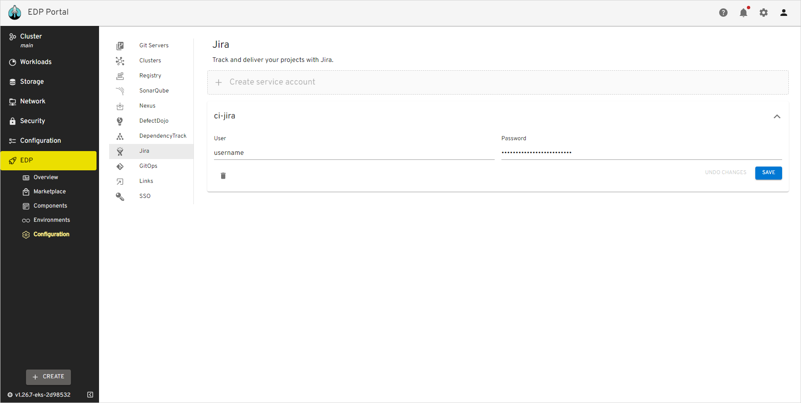
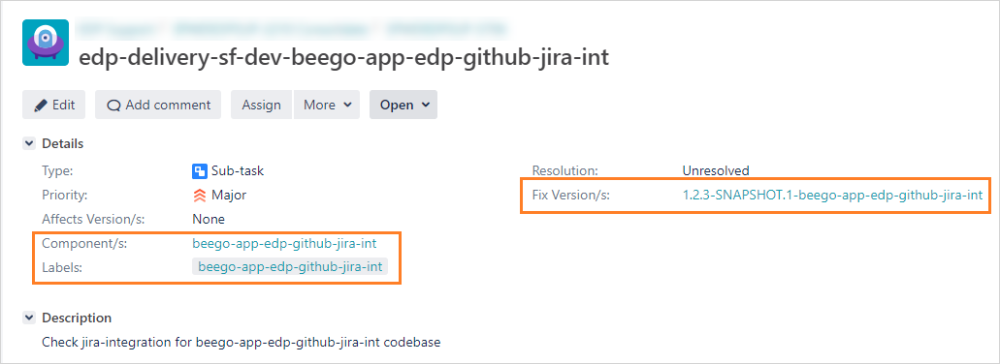

# Adjust Jira Integration

This documentation guide provides step-by-step instructions for enabling the Jira integration option in the EDP Portal UI for EPAM Delivery Platform. Jira integration allows including useful metadata in Jira tickets.

## Overview

Integrating Jira can provide a number of benefits, such as increased visibility and traceability, automatic linking code changes to relevant Jira issues, streamlining the management and tracking of development progress.

By linking CI pipelines to Jira issues, teams can get a better understanding of the status of their work and how it relates to the overall development process. This can help to improve communication and collaboration, and ultimately lead to faster and more efficient delivery of software.

Enabling Jira integration allows for the automatic population of three fields in Jira tickets: Fix Versions, Components, and Labels. Each of these fields provides distinct benefits:

* **Fix Versions**: helps track progress against release schedules;
* **Components**: allows grouping related issues together;
* **Labels**: enables identification of specific types of work.

Teams can utilize these fields to enhance their work prioritization, identify dependencies, improve collaboration, and ultimately achieve faster software delivery.

## Integration Procedure<a name="integration-procedure"></a>

In order to adjust the Jira server integration, add the JiraServer CR by performing the following:

1. Provision the **ci-jira** secret using `EDP Portal`, `Manifest` or with the `externalSecrets` operator:

  === "EDP Portal"

      Go to **EDP Portal** -> **EDP** -> **Configuration** -> **Jira**. Update or fill in the **URL**, **User**, **Password** fields and click the **Save** button:

      !

  === "Manifest"

      ```yaml
      apiVersion: v1
      kind: Secret
      metadata:
        name: ci-jira
        namespace: edp
        labels:
          app.edp.epam.com/secret-type=jira
      stringData:
        username: username
        password: password
      ```

  === "External Secrets Operator"

      ```json
      "ci-jira":
      {
        "username": "username",
        "password": "password"
      }
      ```

  !!! note "Required Permissions for Issue Management"

      To manage issue labels, components, and add links in Jira, please make sure the user has the following permissions:

      1. **Edit Issues:** This permission is necessary to modify issue fields, including adding or removing labels and components.

      2. **Link Issues:** You must have this permission to create and manage links between issues.

      3. **Add Comments:** Required for adding external links and comments to issues.


2. Create JiraServer CR in the OpenShift/Kubernetes namespace with the **apiUrl**, **credentialName** and **rootUrl** fields:

      apiVersion: v2.edp.epam.com/v1
      kind: JiraServer
      metadata:
        name: jira-server
      spec:
        apiUrl: 'https://jira-api.example.com'
        credentialName: ci-jira
        rootUrl: 'https://jira.example.com'

  !!! note
      The value of the **credentialName** property is the name of the Secret, which is indicated in the first point above.

## Enable Jira Using Helm Chart

There is also a possibility to set up Jira integration when deploying EPAM Delivery Platform. To follow this approach, please familiarize yourself with the following parameters of the [values.yaml](https://github.com/epam/edp-install/blob/release/3.8/deploy-templates/values.yaml#L138) file in the EDP installer. Enabling the `jira.integration` parameter creates the following custom resources:

* EDPComponent;
* JiraServer;
* External Secrets Operator (in case it is used).

To set up Jira integration along with EDP, follow the steps below:

1. Create the **ci-jira** secret in the `edp` namespace as it's described [above](#integration-procedure).

2. Deploy the platform with the `jira.integration` parameter set to `true` in the [values.yaml](https://github.com/epam/edp-install/blob/release/3.8/deploy-templates/values.yaml#L138) file.


## Jira Integration Usage

To use Jira integration, you need to set up your codebases accordingly.

When creating a codebase, navigate to the **Advanced Settings** tab. Select the **Integrate with Jira server** check box and fill in the required fields:

  !

There are four predefined variables with the respective values that can be specified singly or as a combination. These variables show different data depending on which versioning type is currently used:

If the EDP versioning type is used:

* **EDP_COMPONENT** – returns application-name;
* **EDP_VERSION** – returns 0.0.0-SNAPSHOT or 0.0.0-RC;
* **EDP_SEM_VERSION** – returns 0.0.0;
* **EDP_GITTAG** – returns build/0.0.0-SNAPSHOT.2 or build/0.0.0-RC.2.

If the default versioning type is used:

* **EDP_COMPONENT** – returns application-name;
* **EDP_VERSION** – returns the date when the application was tagged. (Example: 20231023-131217);
* **EDP_SEM_VERSION** – returns the date when the application was tagged. (Example: 20231023-131217);
* **EDP_GITTAG** – returns the date when the application was tagged. (Example: 20231023-131217).

!!! note
    There are no character restrictions when combining the variables. You can concatenate them using the dash sign. Combination samples:<br>
    **EDP_SEM_VERSION-EDP_COMPONENT**;<br>
    **EDP_COMPONENT-hello-world/EDP_VERSION**;<br>
    etc.

If the Jira integration is set up correctly, you will start seeing additional metadata in the tickets:

  !

If metadata is not visible in a Jira ticket, check the status field of the **JiraIssueMetadata** Custom Resources in the **edp** namespace. The codebase operator deletes this resource after successful processing, but in case of an error, the 'JiraIssueMetadata' resource may still exist within the namespace.

## Related Articles

* [Adjust VCS Integration With Jira](jira-gerrit-integration.md)
* [Add Application](../user-guide/add-application.md)
