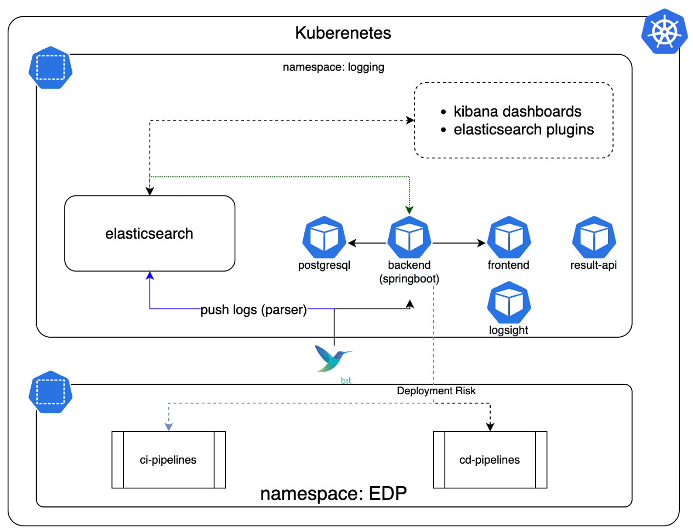
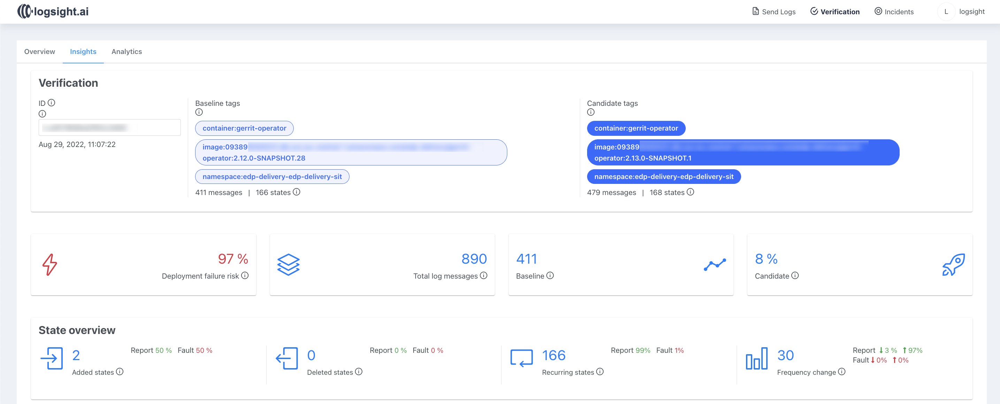
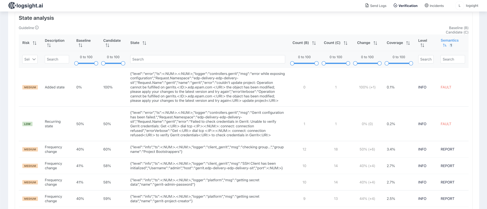

# Logsight Integration

[Logsight](https://logsight.ai/) can be integrated with the CI/CD pipeline. It connects to log data sources, analyses collected logs, and evaluates deployment risk scores.

## Overview

In order to understand if a microservice or a component is ready for the deployment, EDP suggests analyzing logs via Logsight to decide if the deployment is risky or not.

Please find more about Logsight in the official documentation:

* [Logsight key features and workflow](https://docs.logsight.ai/#/?id=key-features)
* [Log analysis](https://docs.logsight.ai/#/auto_logging/overview)
* [Stage verification](https://docs.logsight.ai/#/stage_verification/overview)

## Logsight as a Quality Gate

Integration with Logsight allows enhancing and optimizing software releases by creating an **additional quality gate**.

Logsight can be configured in two ways:

* **SAAS** - online system; for this solution a connection string is required.
* **Self-deployment** - local installation.

To work with Logsight, a new **Deployment Risk stage** must be added to the pipeline. On this stage, the logs are analyzed with the help of Logsight mechanisms.

On the **verification screen** of Logsight, continuous verification of the application deployment can be monitored, and tests can be compared for detecting test flakiness.

For example, two versions of a microservice can be compared in order to detect critical differences. **Risk score** will be calculated for the state reached by version A and version B. Afterwards, the **deployment risk** will be calculated based on individual risk scores.

If the deployment failure risk is greater than a predefined threshold, the verification gate blocks the deployment from going to the target environment. In such case, the Deployment Risk stage of the pipeline is not passed, and additional attention is required. The exact log messages can be displayed in the Logsight verification screen, to help debug the problem.

## Use Logsight for EDP Development

Please find below the detailed description of Logsight integration with EDP.

### Deployment Approach

EDP uses Logsight in a self-deploying mode.

Logsight provides a deployment approach using [Helm charts](https://github.com/aiops/helm-chart-logsight). Please find below the stack of components that must be deployed:

* `logsight` - the core component.
* `logsight-backend` - the backend that provides all necessary APIs and user management.
* `logsight-frontend` - the frontend that provides the user interface.
* `logsight-result-api` - responsible for obtaining results, for example, during the verification.

Below is a diagram of interaction when integrating the components:

  !

### Configure FluentBit for Sending Log Data

Logsight is integrated with the EDP logging stack. The [integration](https://docs.logsight.ai/#/integration/fluentbit) is based on top of the **EFK (ElasticSearch-FluentBit-Kibana) stack**. It is necessary to deploy a stack with the security support, namely, enable the certificate support.

A **FluentBit config** indicates the namespace from which the logs will be received for further analysis. Below is an example of the FluentBit config for getting logs from the `edp-delivery-edp-delivery-sit` namespace:

<details>
<summary><b>View: fluent-bit.conf</b></summary>

```yaml
[INPUT]
    Name              tail
    Tag               kube.sit.*
    Path              /var/log/containers/*edp-delivery-edp-delivery-sit*.log
    Parser            docker
    Mem_Buf_Limit     5MB
    Skip_Long_Lines   Off
    Refresh_Interval  10

[FILTER]
    Name                kubernetes
    Match               kube.sit.*
    Kube_URL            https://kubernetes.default.svc:443
    Kube_CA_File        /var/run/secrets/kubernetes.io/serviceaccount/ca.crt
    Kube_Token_File     /var/run/secrets/kubernetes.io/serviceaccount/token
    Kube_Tag_Prefix     kube.sit.var.log.containers.
    Merge_Log           Off
    K8S-Logging.Parser  On
    K8S-Logging.Exclude On

[FILTER]
    Name nest
    Match kube.sit.*
    Operation lift
    Nested_under kubernetes
    Add_prefix kubernetes.

[FILTER]
    Name modify
    Match kube.sit.*
    Copy kubernetes.container_name tags.container
    Copy log message
    Copy kubernetes.container_image tags.image
    Copy kubernetes.namespace_name tags.namespace

[FILTER]
    Name nest
    Match kube.sit.*
    Operation nest
    Wildcard kubernetes.*
    Nested_under kubernetes
    Remove_prefix kubernetes.

[OUTPUT]
    Name            es
    Match           kube.sit.*
    Host            elasticsearch-master
    Port            9200
    HTTP_User elastic
    HTTP_Passwd *****
    Logstash_Format On
    Logstash_Prefix sit
    Time_Key        @timestamp
    Type            flb_type
    Replace_Dots    On
    Retry_Limit     False

[OUTPUT]
    Match kube.sit.*
    Name  http
    Host logsight-backend
    Port 8080
    http_User logsight@example.com
    http_Passwd *****
    uri /api/v1/logs/singles
    Format json
    json_date_format iso8601
    json_date_key timestamp

```
</details>

### Deployment Risk Analysis

A `deployment-risk` stage is added to the EDP CD pipeline.

!

If the deployment risk is above 70%, the red state of the pipeline is expected.

EDP consists of a set of containerized components. For the convenience of tracking the risk deployment trend for each component, this data is stored as Jenkins artifacts.

If the deployment risk is higher than the threshold of 70%, the EDP promotion of artifacts for the next environments does not pass.
The deployment risk report can be analyzed in order to avoid the potential problems with updating the components.

To study the report in detail, use the link from the Jenkins pipeline to the Logsight verification screen:

!
!

In this example, logs from different versions of the `gerrit-operator` were analyzed. As can be seen from the report, a large number of new messages appeared in the logs, and the output frequency of other notifications has also changed, which led to the high deployment risk.

The environment on which the analysis is performed can exist for different time periods. Logsight only processes the minimum total number of logs since the creating of the environment.

## Related Articles

* [Customize CD Pipeline](../user-guide/customize-cd-pipeline.md)
* [Adjust Jira Integration](jira-integration.md)
