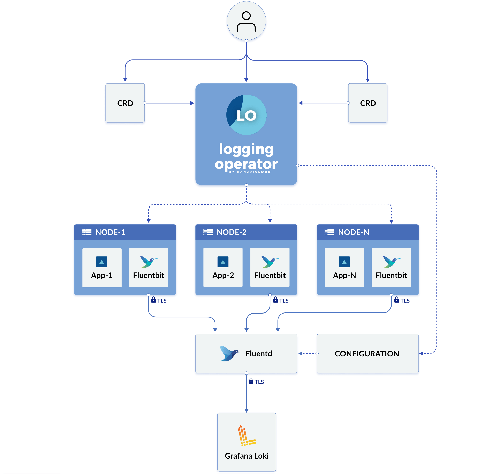
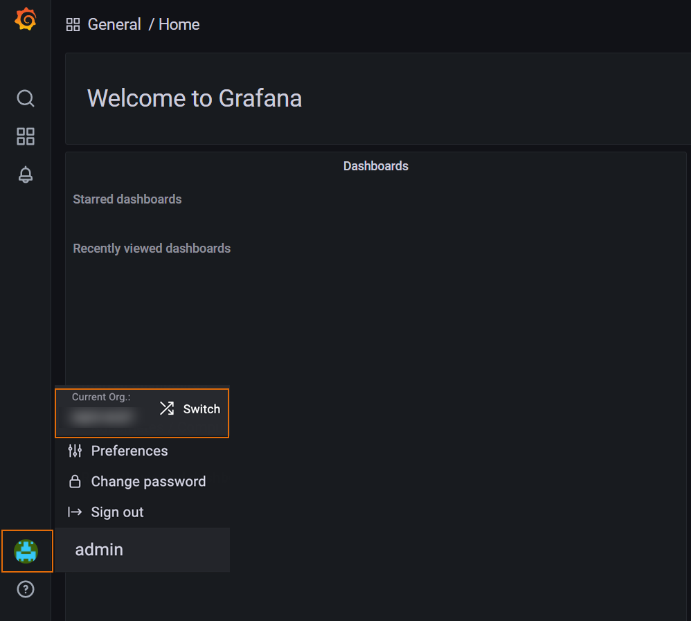
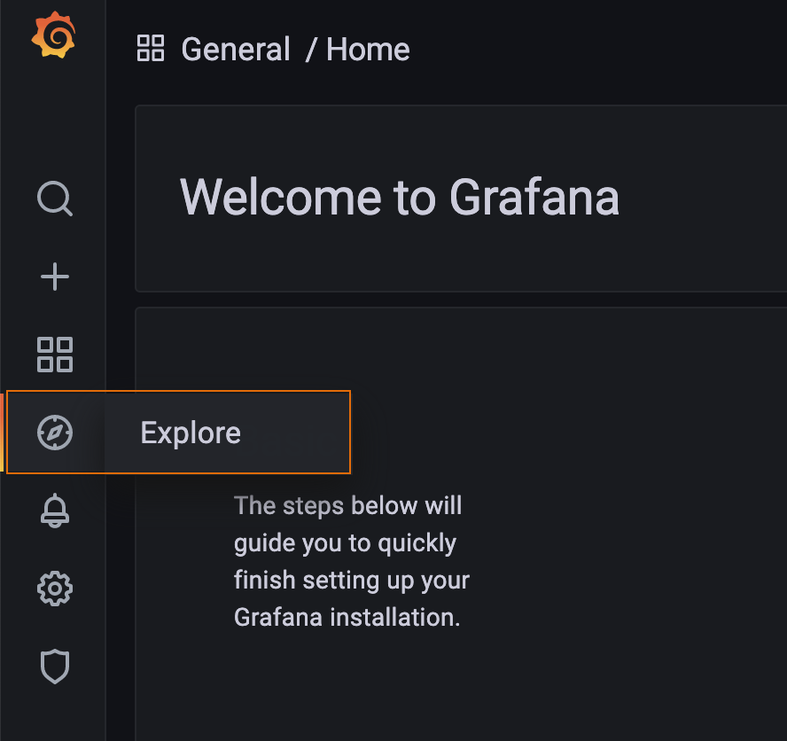
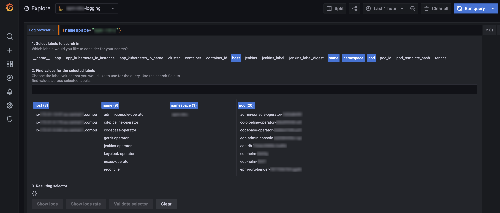
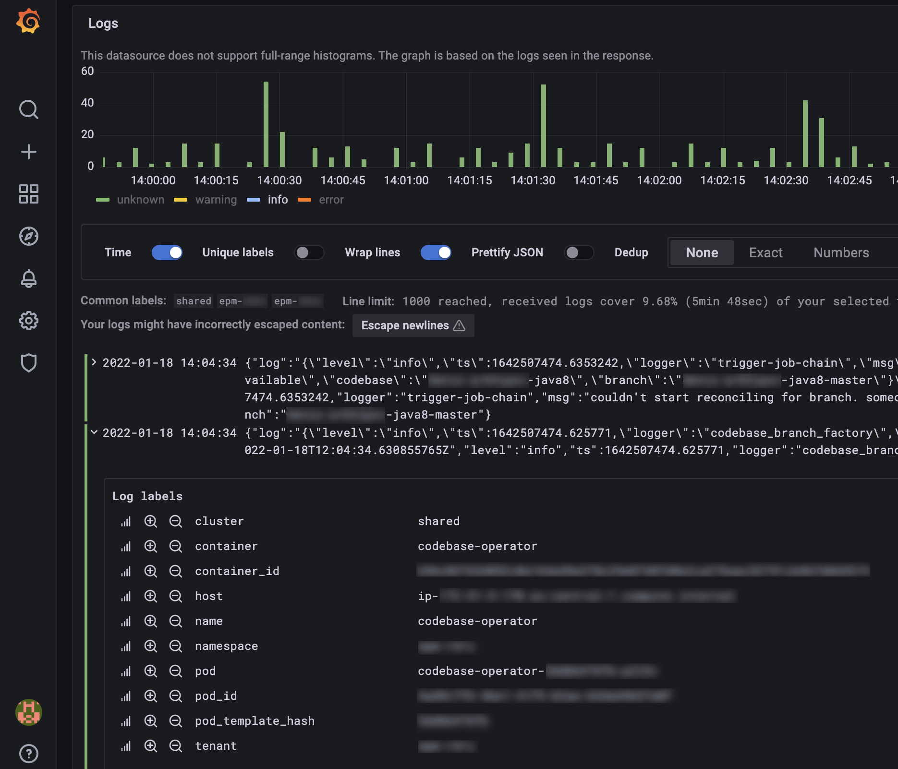

# Multitenant Logging

Get acquainted with the multitenant logging components and the project logs location in the Shared cluster.

## Logging Components

To configure the multitenant logging, it is necessary to deploy the following components:

* [Grafana](https://grafana.com/)
* [Loki](https://grafana.com/oss/loki/)
* [Logging-operator](https://banzaicloud.com/docs/one-eye/logging-operator/)

In Grafana, every tenant represents an organization, i.e. it is necessary to create an organization for every namespace in the cluster.
To get more details regarding the architecture of the Logging Operator, please review the Diagram 1.

!

!!! Note
    It is necessary to deploy Loki with the `auth_enabled: true` flag with the aim to ensure that the logs are separated for each tenant.
    For the authentication, Loki requires the HTTP header X-Scope-OrgID.

## Review Project Logs in Grafana

To find the project logs, navigate to [Grafana](https://grafana.shared.edp-epam.com) and follow the steps below:

!!! Note
    Grafana is a common service for different customers where each customer works in its own separated Grafana Organization
    and doesn't have any access to another project.

1. Choose the organization by clicking the **Current Organization** drop-down list. If a user is assigned to several organizations, switch easily by using the Switch button.

  !

2. Navigate to the left-side menu and click the **Explore** button to see the Log Browser:

  !

3. Click the **Log Browser** button to see the labels that can be used to filter logs (e.g., hostname, namespace, application name, pod, etc.):

  !!! Note
      Enable the correct data source, select the relevant logging data from the top left-side corner, and pay attention that the data source name always follows the &#8249;project_name&#8250;-logging pattern.

  !

4. Filter out logs by clicking the **Show logs** button or write the query and click the **Run query** button.

5. Review the results with the quantity of logs per time, see the example below:

  !

  * Expand the logs to get detailed information about the object entry:

  !

  * Use the following buttons to include or remove the labels from the query:

  !

  * See the ad-hoc statistics for a particular label:

  !

## Related Articles

* [Grafana Documentation](https://grafana.com/docs/grafana/latest/)
