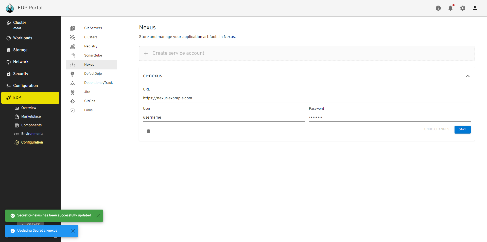
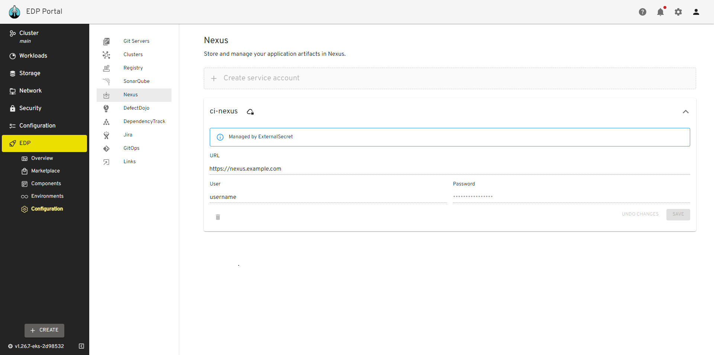

# Nexus Sonatype Integration

This documentation guide provides comprehensive instructions for integrating Nexus with the EPAM Delivery Platform.

!!! info
    In EDP release 3.5, we have changed the deployment strategy for the nexus-operator component, now it is not installed by default. The `nexusURL` parameter management has been transferred from the values.yaml file to Kubernetes secrets.

## Prerequisites

Before proceeding, ensure that you have the following prerequisites:

* [Kubectl](https://v1-26.docs.kubernetes.io/releases/download/) version 1.26.0 is installed.
* [Helm](https://helm.sh) version 3.12.0+ is installed.

## Installation

To install Nexus with pre-defined templates, use the nexus-operator installed via [Cluster Add-Ons](https://github.com/epam/edp-cluster-add-ons) approach.

## Configuration

To ensure strong authentication and accurate access control, creating a Nexus Sonatype service account with the name  ci.user  is crucial. This user serves as a unique identifier, facilitating connection with the EDP ecosystem.

To create the Nexus `ci.user`and define repository parameters follow the steps below: <a name="values"></a>

1. Open the Nexus UI and navigate to `Server administration and configuration` -> `Security` -> `User`. Click the `Create local user` button to create a new user:

  !

2. Type the `ci-user` username, define an expiration period, and click the `Generate` button to create the token:

  !

3. EDP relies on a predetermined repository naming convention all repository names are predefined. Navigate to `Server administration and configuration` -> `Repository` -> `Repositories` in Nexus. You can only create a repository with the required language.

  !

  === "Java"

      a) Click Create a repository by selecting "maven2(proxy)" and set the name as "edp-maven-proxy". Enter the remote storage URL as "https://repo1.maven.org/maven2/". Save the configuration.

      b) Click Create a repository by selecting "maven2(hosted)" and set the name as "edp-maven-snapshot". Change the Version policy to "snapshot". Save the configuration.

      c) Click Create a repository by selecting "maven2(hosted)" and set the name as "edp-maven-releases". Change the Version policy to "release". Save the configuration.

      d) Click Create a repository by selecting "maven2(group)" and set the name as "edp-maven-group". Change the Version policy to "release". Add repository to group. Save the configuration.

  === "JavaScript"

      a) Click Create a repository by selecting "npm(proxy)" and set the name as "edp-npm-proxy". Enter the remote storage URL as "https://registry.npmjs.org". Save the configuration.

      b) Click Create a repository by selecting "npm(hosted)" and set the name as "edp-npm-snapshot". Save the configuration.

      c) Click Create a repository by selecting "npm(hosted)" and set the name as "edp-npm-releases". Save the configuration.

      d) Click Create a repository by selecting "npm(hosted)" and set the name as "edp-npm-hosted". Save the configuration.

      e) Click Create a repository by selecting "npm(group)" and set the name as "edp-npm-group". Add repository to group. Save the configuration.

  === "Dotnet"

      a) Click Create a repository by selecting "nuget(proxy)" and set the name as "edp-dotnet-proxy". Select Protocol version NuGet V3. Enter the remote storage URL as "https://api.nuget.org/v3/index.json". Save the configuration.

      b) Click Create a repository by selecting "nuget(hosted)" and set the name as "edp-dotnet-snapshot". Save the configuration.

      c) Click Create a repository by selecting "nuget(hosted)" and set the name as "edp-dotnet-releases". Save the configuration.

      d) Click Create a repository by selecting "nuget(hosted)" and set the name as "edp-dotnet-hosted". Save the configuration.

      e) Click Create a repository by selecting "nuget(group)" and set the name as "edp-dotnet-group". Add repository to group. Save the configuration.

  === "Python"

      a) Click Create a repository by selecting "pypi(proxy)" and set the name as "edp-python-proxy". Enter the remote storage URL as "https://pypi.org". Save the configuration.

      b) Click Create a repository by selecting "pypi(hosted)" and set the name as "edp-python-snapshot". Save the configuration.

      c) Click Create a repository by selecting "pypi(hosted)" and set the name as "edp-python-releases". Save the configuration.

      d) Click Create a repository by selecting "pypi(group)" and set the name as "edp-python-group". Add repository to group. Save the configuration.


4. Provision secrets using manifest, EDP Portal or with the externalSecrets operator

=== "EDP Portal"

    Go to **EDP Portal** -> **EDP** -> **Configuration** -> **Nexus**. Update or fill in the **URL**, **nexus-user-id**, **nexus-user-password** and click the **Save** button:

    !

=== "Manifest"

    ```yaml
    apiVersion: v1
    kind: Secret
    metadata:
      name: ci-nexus
      namespace: edp
      labels:
        app.edp.epam.com/secret-type: nexus
    type: Opaque
    stringData:
      url: https://nexus.example.com
      username: <nexus-user-id>
      password: <nexus-user-password>
    ```

=== "External Secrets Operator"

    ```json
    "ci-nexus":
    {
      "url": "https://nexus.example.com",
      "username": "XXXXXXX",
      "password": "XXXXXXX"
    },
    ```

    Go to **EDP Portal** -> **EDP** -> **Configuration** -> **Nexus** and see `Managed by External Secret` message.

    !

    More detail of External Secrets Operator Integration can found on [the following page](https://epam.github.io/edp-install/operator-guide/external-secrets-operator-integration/)

## Related Articles
* [Install EDP With Values File](install-edp.md)
* [Install External Secrets Operator](install-external-secrets-operator.md)
* [External Secrets Operator Integration](external-secrets-operator-integration.md)
* [Cluster Add-Ons Overview](add-ons-overview.md)
