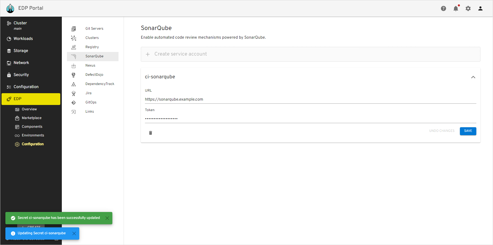

# SonarQube Integration

This documentation guide provides comprehensive instructions for integrating external SonarQube with the EPAM Delivery Platform.

## Prerequisites

Before proceeding, ensure that you have the following prerequisites:

* [Kubectl](https://v1-26.docs.kubernetes.io/releases/download/) version 1.26.0 is installed.
* [Helm](https://helm.sh) version 3.12.0+ is installed.

EDP includes a pre-installed SonarQube instance, which is ready to use with no extra configuration, delivering code analysis capabilities out of the box. Yet, EDP maintains the option to integrate external SonarQube instances tailored to specific project needs.

## Switch to External Sonarqube

1. To use external SonarQube in EDP, redefine the following parameters in the EDP-install [values.yaml](https://github.com/epam/edp-install/blob/master/deploy-templates/values.yaml) file. In the `sonarUrl` parameter, input the appropriate values for your SonarQube service, namespace and a port `http://<service-name>.<sonarqube-namespace>:9000`. Alternatively, use the address and a port to external SonarQube `http(s)://<endpoint>` instead.

  ```yaml
  global:
    sonarUrl: ""

  sonar-operator:
    enabled: false
  ```

2. Proceed with the installation of EDP by following the [Install EDP](../operator-guide/install-edp.md) guide.

!!! note
    You can install preconfigured SonarQube with edp-sonar-operator using [EDP addons](https://github.com/epam/edp-cluster-add-ons) approach.

## Configuration

To establish robust authentication and precise access control, generating a SonarQube token is essential. This token is a distinct identifier, enabling effortless integration between SonarQube and EDP. To generate the SonarQube token, proceed with the following steps:

1. Open the SonarQube UI and navigate to `Administration` -> `Security` -> `User`. Create a new user or select an existing one. Click the `Options List` icon to create a token:

  !

2. Type the `ci-user` username, define an expiration period, and click the `Generate` button to create the token:

  !

3. Click the `Copy` button to copy the generated `<Sonarqube-token>`:

  !

4. Provision secrets using kubectl, EDP Portal or with the externalSecrets operator

=== "kubectl"

    ```bash
    kubectl -n <edp_namespace> create secret generic sonar-ciuser-token \
    --from-literal=username=<username> \
    --from-literal=secret=<Sonarqube-token>
    ```

=== "Manual Secret"

    Go to the `EDP Portal UI` open `EDP` -> `Configuration` -> `Sonarqube Integration` change or apply `User` and `password` and click `save` button.

    !

=== "External Secrets Operator"

    ```yaml
    "sonar-ciuser-token":
    {
      "username": "XXXXXXXXXXXX",
      "secret": "XXXXXXXXXXXX"
    },
    ```

    Go to the `EDP Platform UI` open `EDP` -> `Configuration` -> `Sonarqube Integration` yo will se message `Managed by External Secret`.

    !

    More detail of External Secrets Operator Integration can found on [the following page](https://epam.github.io/edp-install/operator-guide/external-secrets-operator-integration/)

## Related Articles
* [Install EDP With Values File](install-edp.md)
* [Install External Secrets Operator](install-external-secrets-operator.md)
* [External Secrets Operator Integration](external-secrets-operator-integration.md)