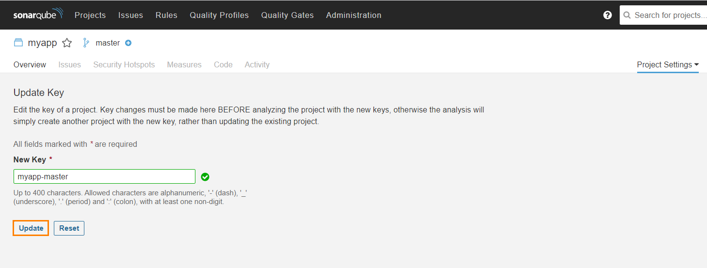

# Upgrade EDP v.2.10.x to v.2.11.x

This section provides the details on the EDP upgrade from the v.2.10.x to the v.2.11.x. Explore the actions and requirements below.

1. Update Custom Resource Definitions. Run the following command to apply all the necessary CRDs to the cluster:

      kubectl apply -f https://raw.githubusercontent.com/epam/edp-codebase-operator/release/2.12/deploy-templates/crds/edp_v1alpha1_cd_stage_deploy_crd.yaml
      kubectl apply -f https://raw.githubusercontent.com/epam/edp-gerrit-operator/release/2.11/deploy-templates/crds/v2_v1alpha1_merge_request_crd.yaml
      kubectl apply -f https://raw.githubusercontent.com/epam/edp-nexus-operator/release/2.11/deploy-templates/crds/edp_v1alpha1_user_crd.yaml
      kubectl apply -f https://raw.githubusercontent.com/epam/edp-cd-pipeline-operator/release/2.11/deploy-templates/crds/edp_v1alpha1_cdpipeline_crd.yaml
      kubectl apply -f https://raw.githubusercontent.com/epam/edp-jenkins-operator/release/2.11/deploy-templates/crds/v2_v1alpha1_jenkinssharedlibrary_crd.yaml
      kubectl apply -f https://raw.githubusercontent.com/epam/edp-jenkins-operator/release/2.11/deploy-templates/crds/v2_v1alpha1_cdstagejenkinsdeployment_crd.yaml
      kubectl apply -f https://raw.githubusercontent.com/epam/edp-keycloak-operator/release/1.11/deploy-templates/crds/v1_v1alpha1_keycloakauthflow_crd.yaml
      kubectl apply -f https://raw.githubusercontent.com/epam/edp-keycloak-operator/release/1.11/deploy-templates/crds/v1_v1alpha1_keycloakrealmuser_crd.yaml
      kubectl apply -f https://raw.githubusercontent.com/epam/edp-codebase-operator/release/2.12/deploy-templates/crds/edp_v1alpha1_codebaseimagestream_crd.yaml
      kubectl apply -f https://raw.githubusercontent.com/epam/edp-codebase-operator/release/2.12/deploy-templates/crds/edp_v1alpha1_codebase_crd.yaml
      kubectl apply -f https://raw.githubusercontent.com/epam/edp-sonar-operator/release/2.11/deploy-templates/crds/edp_v1alpha1_sonar_group_crd.yaml
      kubectl apply -f https://raw.githubusercontent.com/epam/edp-sonar-operator/release/2.11/deploy-templates/crds/edp_v1alpha1_permission_template_crd.yaml

2. Backup kaniko-template config-map and then remove it. This component will be delivered during upgrade.

3. Set required awsRegion parameter. Pay attention that the nesting of the kanikoRoleArn parameter has been changed to the kaniko.roleArn parameter. Check the parameters in the EDP installation chart. For details, please refer to the [values.yaml](https://github.com/epam/edp-install/blob/release/2.11/deploy-templates/values.yaml) file.
To upgrade EDP to the v.2.11.x, run the following command:

      helm upgrade edp epamedp/edp-install -n <edp-namespace> --values values.yaml --version=2.11.x

  !!! Note
      To verify the installation, it is possible to test the deployment before applying it to the cluster with:<br>
      `helm upgrade edp epamedp/edp-install -n <edp-namespace> --values values.yaml --version=2.11.x  --dry-run`

4. Update Sonar Project Key:

  !!! Note
      Avoid using special characters when creating projects in SonarQube. Allowed characters are: `letters`, `numbers`, `-`, `_`, `.` and `:`, with at least one non-digit. For details, please refer to the [SonarQube documentation](https://docs.sonarqube.org/latest/analysis/analysis-parameters/). As the result, the project name will be: `project-name-release-0.0` or `project-name-branchName`.

  Such actions are required to be followed with the aim to store the SonarQube statistics from the previous EDP version:

  !!! Warning
      Do not run any pipeline with the updated **sonar stage** on any existing application before the completion of the first step.

    4.1. Update the project key in SonarQube from old to new format by adding the default branch name.

    - Navigate to Project Settings -> Update Key:
    !
    - Enter the default branch name and click Update:
    !

    4.2. As the result, after the first run, the project name will be changed to a new format containing all previous statistics:

    !

5. Update image versions for the Jenkins agents in the *ConfigMap*:

        kubectl edit configmap jenkins-slaves -n <edp-namespace>

   * The versions of the images should be:

        epamedp/edp-jenkins-codenarc-agent:3.0.4
        epamedp/edp-jenkins-dotnet-21-agent:3.0.4
        epamedp/edp-jenkins-dotnet-31-agent:3.0.3
        epamedp/edp-jenkins-go-agent:3.0.5
        epamedp/edp-jenkins-gradle-java11-agent:3.0.2
        epamedp/edp-jenkins-gradle-java8-agent:3.0.2
        epamedp/edp-jenkins-helm-agent:3.0.3
        epamedp/edp-jenkins-maven-java11-agent:3.0.3
        epamedp/edp-jenkins-maven-java8-agent:3.0.3
        epamedp/edp-jenkins-npm-agent:3.0.4
        epamedp/edp-jenkins-opa-agent:3.0.2
        epamedp/edp-jenkins-python-38-agent:3.0.2
        epamedp/edp-jenkins-terraform-agent:3.0.3

   * Add Jenkins agent by following the template:

    <details>
    <summary><b>View: values.yaml</b></summary>

    ```yaml
    kaniko-docker-template: |-
      <org.csanchez.jenkins.plugins.kubernetes.PodTemplate>
        <inheritFrom></inheritFrom>
        <name>kaniko-docker</name>
        <namespace></namespace>
        <privileged>false</privileged>
        <alwaysPullImage>false</alwaysPullImage>
        <instanceCap>2147483647</instanceCap>
        <slaveConnectTimeout>100</slaveConnectTimeout>
        <idleMinutes>5</idleMinutes>
        <activeDeadlineSeconds>0</activeDeadlineSeconds>
        <label>kaniko-docker</label>
        <serviceAccount>jenkins</serviceAccount>
        <nodeSelector>beta.kubernetes.io/os=linux</nodeSelector>
        <nodeUsageMode>NORMAL</nodeUsageMode>
        <workspaceVolume class="org.csanchez.jenkins.plugins.kubernetes.volumes.workspace.EmptyDirWorkspaceVolume">
            <memory>false</memory>
        </workspaceVolume>
        <volumes/>
        <containers>
            <org.csanchez.jenkins.plugins.kubernetes.ContainerTemplate>
            <name>jnlp</name>
            <image>epamedp/edp-jenkins-kaniko-docker-agent:1.0.4</image>
            <privileged>false</privileged>
            <alwaysPullImage>false</alwaysPullImage>
            <workingDir>/tmp</workingDir>
            <command></command>
            <args>${computer.jnlpmac} ${computer.name}</args>
            <ttyEnabled>false</ttyEnabled>
            <resourceRequestCpu></resourceRequestCpu>
            <resourceRequestMemory></resourceRequestMemory>
            <resourceLimitCpu></resourceLimitCpu>
            <resourceLimitMemory></resourceLimitMemory>
            <envVars>
                <org.csanchez.jenkins.plugins.kubernetes.model.KeyValueEnvVar>
                <key>JAVA_TOOL_OPTIONS</key>
                <value>-XX:+UnlockExperimentalVMOptions -Dsun.zip.disableMemoryMapping=true</value>
                </org.csanchez.jenkins.plugins.kubernetes.model.KeyValueEnvVar>
            </envVars>
            <ports/>
            </org.csanchez.jenkins.plugins.kubernetes.ContainerTemplate>
        </containers>
        <envVars/>
        <annotations/>
        <imagePullSecrets/>
        <podRetention class="org.csanchez.jenkins.plugins.kubernetes.pod.retention.Default"/>
        </org.csanchez.jenkins.plugins.kubernetes.PodTemplate>
    ```

    </details>

   * Restart the Jenkins pod.

6. Update the Jenkins plugins with the 'pipeline' name and 'HTTP Request Plugin'.
7. Update Jenkins provisioners according to the [Manage Jenkins CI Pipeline Job Provisioner](../operator-guide/manage-jenkins-ci-job-provision.md) and [Manage Jenkins CD Pipeline Job Provisioner](../operator-guide/manage-jenkins-cd-job-provision.md) documentation.

8. Restart the codebase-operator to recreate the Code-review and Build pipelines for codebases.
9. Run the CD job-provisioners for every CD pipeline to align the CD stages.