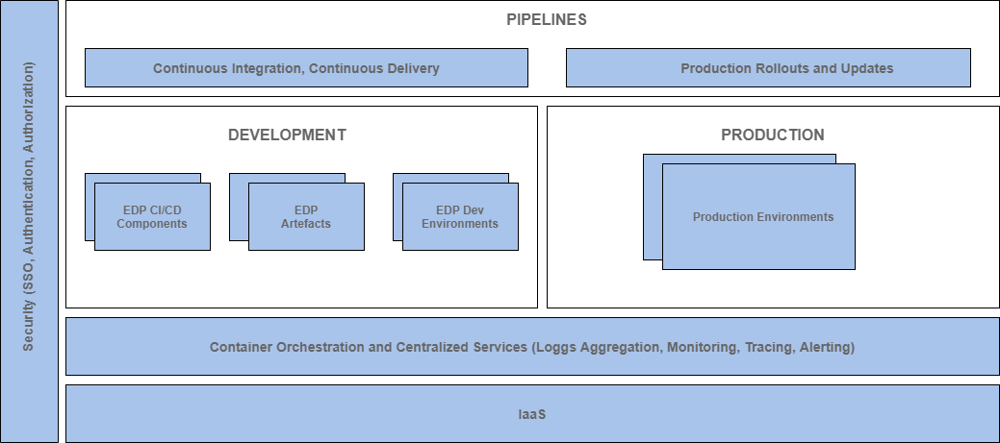

# Overview

**EPAM Delivery Platform (EDP)** is an **open-source** cloud-agnostic SaaS/PaaS solution for software development, licensed under **Apache License 2.0**. It provides a pre-defined set of CI/CD patterns and tools, which allow a user to start product development quickly with established **code review**, **release**, **versioning**, **branching**, **build** processes. These processes include static code analysis, security checks, linters, validators, dynamic feature environments provisioning. EDP consolidates the top Open-Source CI/CD tools by running them on Kubernetes/OpenShift, which enables web/app development either in isolated (on-prem) or cloud environments.

EPAM Delivery Platform, which is also called **"The Rocket"**, is a platform that allows shortening the time that is passed before an active development can be started from several months to several hours.

EDP consists of the following:

- The platform based on managed infrastructure and container orchestration
- Security covering authentication, authorization, and SSO for platform services
- Development and testing toolset
- Well-established engineering process and EPAM practices (EngX) reflected in CI/CD pipelines, and delivery analytics
- Local development with debug capabilities

## Features

- Deployed and configured CI/CD toolset ([Tekton](https://tekton.dev/){target=_blank}, [ArgoCD](https://argoproj.github.io/cd/){target=_blank}, [Jenkins](https://www.jenkins.io/){target=_blank}, [Nexus](https://help.sonatype.com/repomanager3){target=_blank}, [SonarQube](https://www.sonarqube.org/){target=_blank}, [DefectDojo](https://www.defectdojo.org/){target=_blank})
- [Gerrit](https://www.gerritcodereview.com/), [GitLab](https://about.gitlab.com/features/) or [GitHub](https://about.gitlab.com/features/) as a version control system for your code
- [Tekton](./operator-guide/install-tekton.md) is a **default** pipeline orchestrator
- [Jenkins](./operator-guide/overview-manage-jenkins-pipelines.md) is an optional pipeline orchestrator
- [CI pipelines](./user-guide/pipeline-framework.md) for Python, Java, .Net, Go, React, Terraform, Jenkins Groovy Pipelines, Dockerfile, Helm
- Build tools: Go, Apache Maven, Apache Gradle
- [Headlamp UI](./headlamp-user-guide/index.md) as a single entry point
- [CD pipeline](./user-guide/customize-cd-pipeline.md) for Microservice Deployment
- Kubernetes native approach ([CRD, CR](https://kubernetes.io/docs/concepts/extend-kubernetes/api-extension/custom-resources/){target=_blank}) to declare CI/CD pipelines

## What's Inside

EPAM Delivery Platform (EDP) is suitable for all aspects of delivery starting from development including the capability to deploy production environment.
EDP architecture is represented on a diagram below.

!

EDP consists of four cross-cutting concerns:

1. Infrastructure as a Service;
2. GitOps approach;
3. Container orchestration and centralized services;
4. Security.

On the top of these indicated concerns, EDP adds several blocks that include:

- **EDP CI/CD Components**. EDP component enables a feature in CI/CD or an instance artifacts storage and distribution (Nexus or Artifactory), static code analysis (Sonar), etc.;
- **EDP Artifacts**. This element represents an artifact that is being delivered through EDP and presented as a code.

    >_Artifact samples: frontend, backend, mobile, applications, functional and non-functional autotests, workloads for 3rd party components that can be deployed together with applications._

- **EDP development and production environments** that share the same logic. Environments wrap a set of artifacts with a specific version, and allow performing SDLC routines in order to be sure of the artifacts quality;
- **Pipelines**. Pipelines cover CI/CD process, production rollout and updates. They also connect three elements indicated above via automation allowing SDLC routines to be non-human;

### Technology Stack

Explore the EDP technology stack diagram

!

The EDP IaaS layer supports most popular public clouds AWS, Azure and GCP keeping the capability to be deployed on private/hybrid clouds based on OpenStack.
EDP containers are based on [Docker technology](https://www.docker.com/){target=_blank}, orchestrated by Kubernetes compatible solutions.

There are two main options for Kubernetes provided by EDP:

- Managed Kubernetes in Public Clouds to avoid installation and management of Kubernetes cluster, and get all benefits of scaling, reliability of this solution;
- OpenShift that is a Platform as a Service on the top of Kubernetes from Red Hat. OpenShift is the default option for on-premise installation and it can be considered whether the _solution built on the top of EDP_ should be **cloud-agnostic** or require **enterprise support**;

There is no limitation to run EDP on vanilla Kubernetes.
