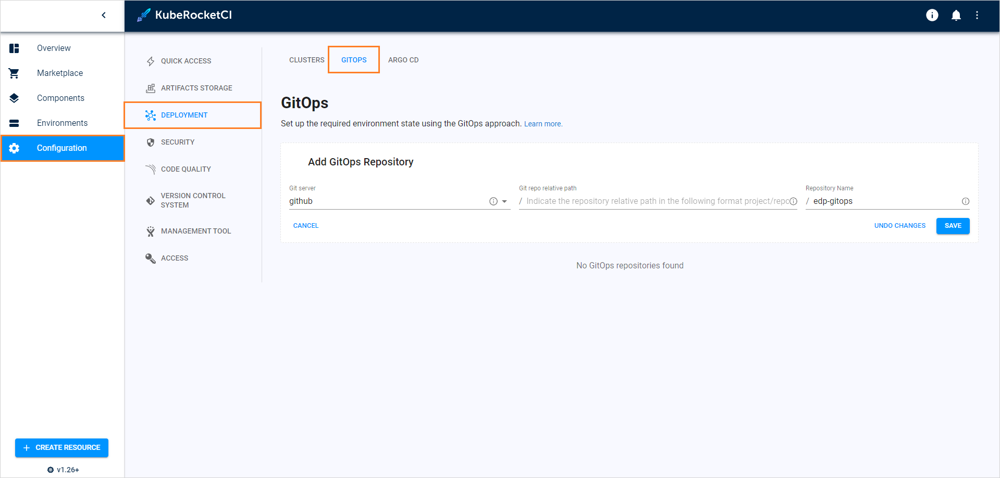
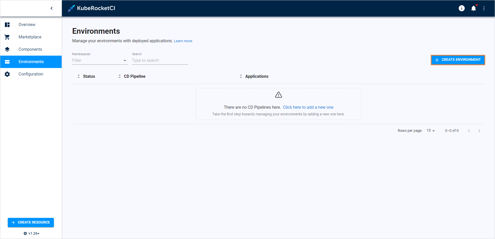
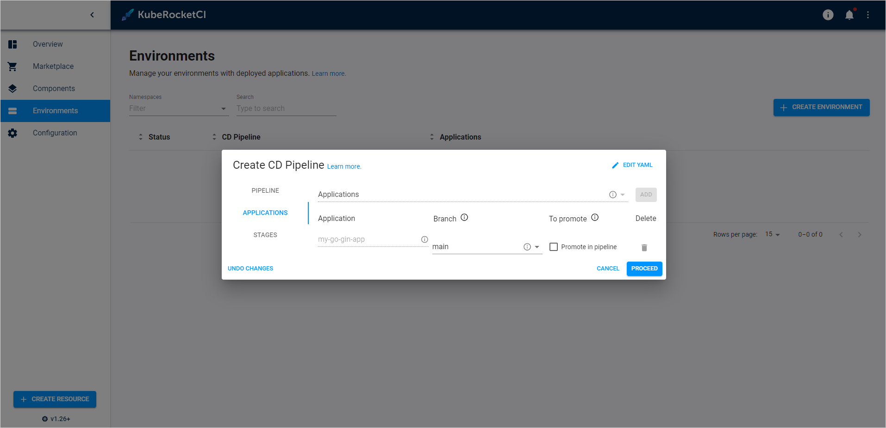
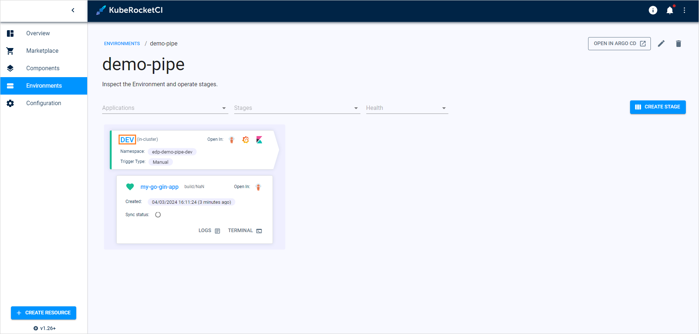
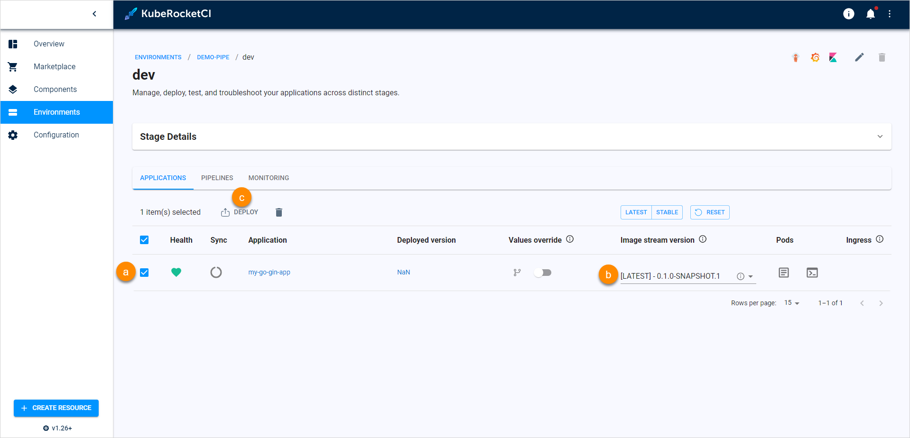

# Deploy Application

Now, proceed to deploy our first application. This page provides comprehensive instructions on creating an environment and deploying the application within it.

## Create GitOps Repository

As a prerequisite, create a GitOps repository in your GitHub account. EDP Portal adheres to the GitOps approach when working with environments. In a GitOps repository, values are saved to redefine the default behavior (parameters) of deployment for each environment. The creation of a GitOps repository involves the following two steps:

1. In EDP Portal, navigate to `EDP` -> `Configuration` -> `GitOps` and click the **+ Add GitOps Repository** button:

  !

2. Fill in the Git repo relative path (account name) and repository name fields and click **Save**:

  !

## Create Environment

To create an environment, follow the steps below:

1. In EDP Portal, navigate to `EDP` -> `Environments` and click the **+ Create** button:

  !

2. In the **Create CD Pipeline** window, enter the pipeline name and click the **Proceed** button:

  !

3. In the **Applications** tab, select the go-application and main branch:

  !

4. In the **Stages** tab, click the **Add Stage** button.

5. Fill in the required fields and click the **Apply** button:

  !

6. In the **Stages** tab, click the **Apply** button.

## Application Deployment

To Deploy application, follow the steps below:

1. In the Environments list, click the Environment name:

  !

2. In the Environment details page, click the stage name to enter the stage details:

  !

3. Once you enter the stage details, proceed to deploy the application:

  1. Select an application;
  2. Select the Image stream version;
  3. Click the **Deploy** button.

  !

Congratulations! You have passed the Quick Start guide! We hope you enjoyed this journey.

Now that you have a good understanding of how EDP works, you can further enhance its capabilities by integrating it with [Nexus](../operator-guide/nexus-sonatype.md). Additionally, explore other functionalities detailed in our [Use Cases](../use-cases/index.md) section. If you're eager to unlock the full potential of EDP, navigate to the [Operator Guide](../operator-guide/index.md) to fine-tune your EDP for optimal performance!

  !
