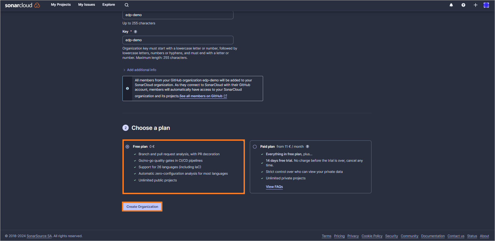
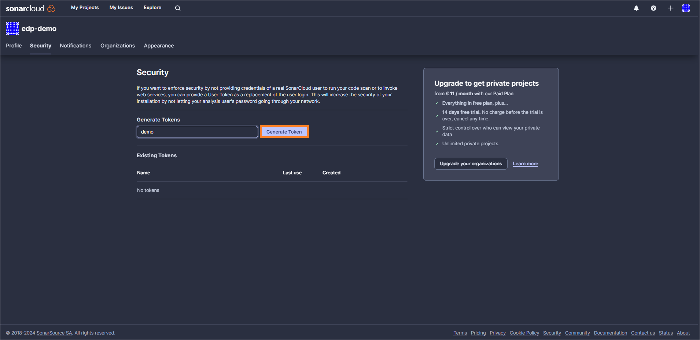
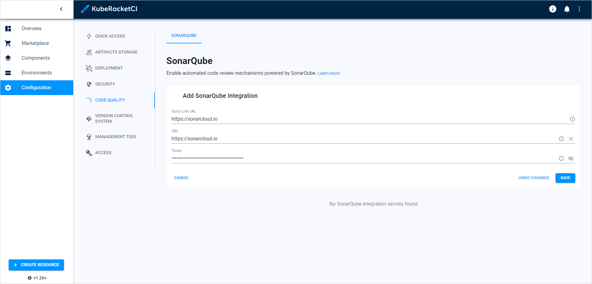

# Integrate SonarQube

It is mandatory for EDP to have SonarQube integrated with the platform as all the pipelines include the `sonar` step.

SonarQube is a robust tool employed in build and code review pipelines to elevate code quality by detecting and reporting issues, along with offering improvement recommendations. SonarCloud, the SaaS solution provided by SonarQube, serves this purpose.

This guide will lead you through the configuration process of SonarCloud for your project.

!!! note
    An alternative option is to use an independent [SonarQube instance](../operator-guide/sonarqube.md).

## Integrate SonarCloud

To integrate SonarCloud with the platform, follow the steps below:

1. Sign up in the [SonarCloud](https://sonarcloud.io) with your GitHub account.

2. Once you are logged in with GitHub, import an organization from GitHub:

  !

  !!! note
      It is crucial to have the organization created in SonarCloud. If you were signed up in SonarCloud using a GitHub account, SonarCloud will suggest you creating an organization with name that is equivalent to your GitHub account name.

3. In the Create an organization menu, choose the free plan and click **Create organization**:

  !

4. In your account menu, select the **Security** tab and generate token:

  !

5. In EDP Portal, navigate to `EDP` -> `Configuration` -> `Code Quality`. Define the following values and click **Save**:

  * URL: `https://sonarcloud.io` 
  * Token: `account token generated in SonarCloud`

  !

After completing the SonarQube integration, proceed to integrate the platform with GitHub. Navigate to the [Integrate GitHub](integrate-github.md) page for further instructions.
