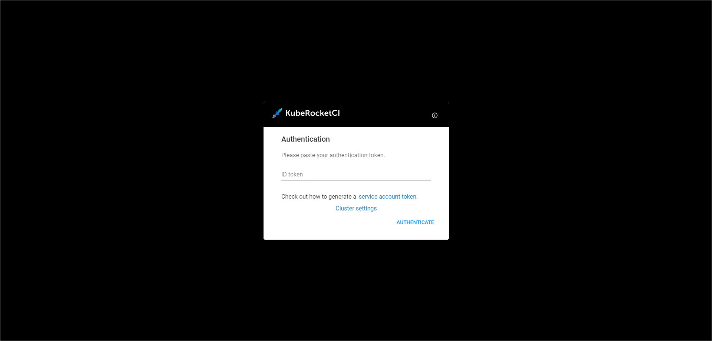

# Install EDP

This page serves as the starting point for the quick start guide, where we will install Tekton as a prerequisite and then proceed to install the EPAM Delivery Platform itself.


## Install Tekton

EPAM Delivery Platform relies on Tekton resources, including Tasks, Pipelines, Triggers, and Interceptors to execute CI/CD pipelines.

To install Tekton, run the commands below:

  ```bash
  kubectl apply -f https://storage.googleapis.com/tekton-releases/pipeline/previous/v0.53.3/release.yaml
  kubectl apply -f https://storage.googleapis.com/tekton-releases/triggers/previous/v0.25.3/release.yaml
  kubectl apply -f https://storage.googleapis.com/tekton-releases/triggers/previous/v0.25.3/interceptors.yaml
  ```

## Install EDP

To deploy the platform, follow the steps below:

1. Add a Helm Chart repository:

  ```bash
  helm repo add epamedp https://epam.github.io/edp-helm-charts/stable
  helm repo update
  ```

2. Deploy the platform using the `helm install` command:

  ```bash
  helm install edp epamedp/edp-install --version 3.8.1 --create-namespace --atomic -n edp --set global.dnsWildCard=example.com
  ```

3. Upon successful deployment of the EDP Helm Chart, run the `kubectl port-forward` command:

  ```bash
  kubectl port-forward service/edp-headlamp 59480:80 -n edp
  ```

4. Enter the localhost in your browser to access the login menu:

    ```bash
    localhost:59480
    ```

    !

5. Create the edp-admin service account and generate an access token to open the EDP Portal:

  ```bash
    kubectl -n edp create serviceaccount edp-admin
    kubectl create clusterrolebinding edp-admin --serviceaccount=edp:edp-admin --clusterrole=cluster-admin
    kubectl create token edp-admin -n edp
  ```

6. In the login menu, paste the generated token in the **ID token** field and click the **Authenticate** button.

7. Upon logging in, specify the namespace for EDP Portal where EDP is deployed by clicking the **cluster settings** link in the bottom left corner of the UI:

  !

8. In the **Cluster Settings** page, define the following for fields:

  * Default namespace: `edp`<br>
  * Allowed namespaces: `edp`

  !

!!! note
    Remember to click the **+** icon when adding the allowed namespace.

After completing these steps, you will get access to EPAM Delivery Platform components through the EDP Portal UI. You can now proceed with the integration steps, starting with the [SonarQube](integrate-sonarcloud.md) integration.
