---
hide:
  - navigation
---

# Deploy Application With Custom Build Tool/Framework

This Use Case describes the procedure of adding custom Tekton libraries that include pipelines with tasks. In addition to it, the process of modifying custom pipelines and tasks is enlightened as well.

## __Goals__

- Add custom Tekton pipeline library;
- Modify existing pipelines and tasks in a custom Tekton library.

## __Preconditions__

- EDP instance with Gerrit and Tekton inside is [configured](../operator-guide/prerequisites.md);
- Developer has access to the EDP instances using the Single-Sign-On approach;
- Developer has the `Administrator` role to perform merge in Gerrit.

## Scenario

!!! Note
    This case is based on our predefined repository and application. Your case may be different.

To create and then modify a custom Tekton library, please follow the steps below:

### Add Custom Application to EDP

1. Open EDP Portal URL. Use the Sign-In option:

  !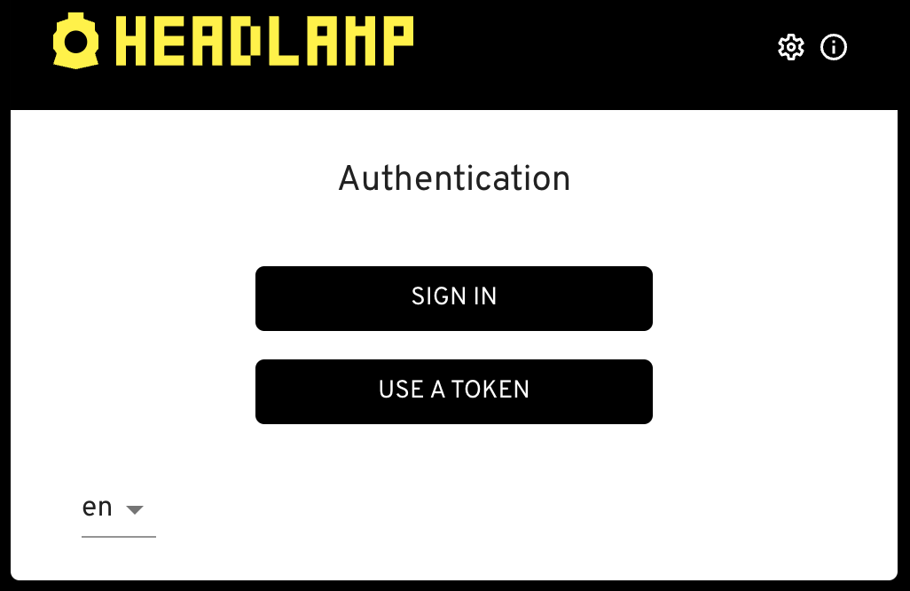

2. In the top right corner, enter the `Cluster settings` and ensure that both `Default namespace` and `Allowed namespace` are set:

  !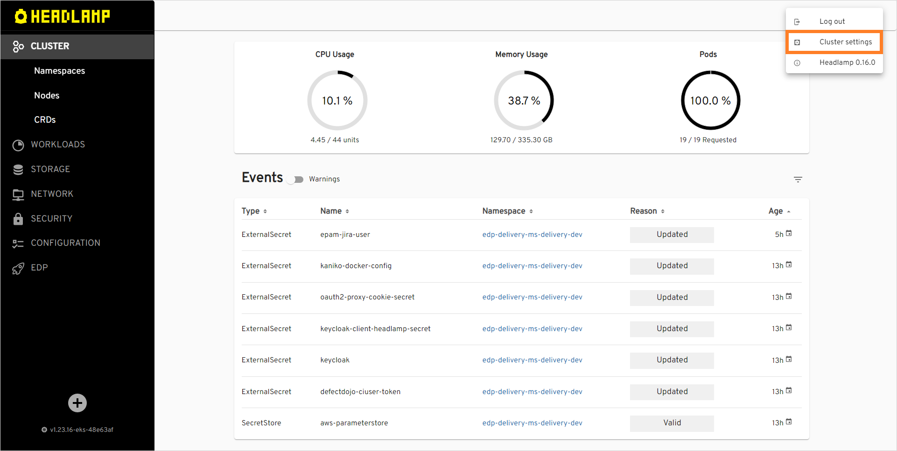

3. Create the new `Codebase` with the `Application` type using the `Clone` strategy. To do this, click the EDP tab:

  !

4. Select the `Components` section under the EDP tab and push the create `+` button:

  !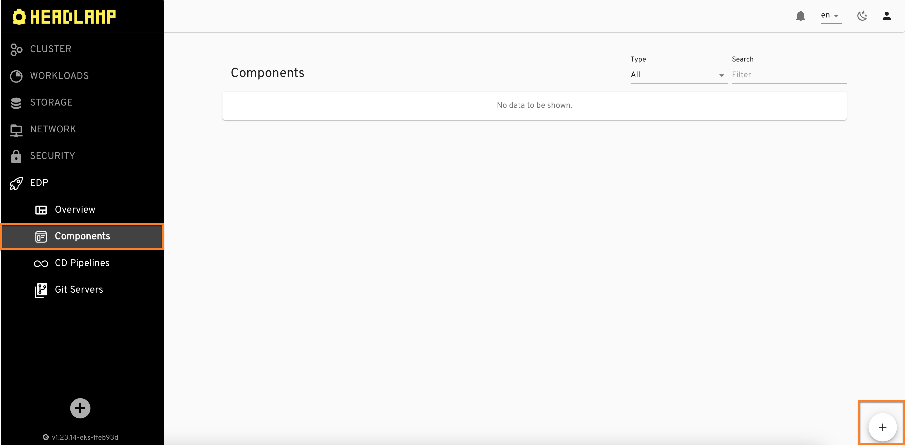

5. Select the `Application` codebase type because is meant to be delivered as a container and deployed inside the Kubernetes cluster. Choose the `Clone` strategy and this example [repository](https://github.com/epmd-edp/go-go-beego.git):

  !

6. In the Application Info tab, define the following values and click the `Proceed` button:

  - Application name: `tekton-hello-world`
  - Default branch: `master`
  - Application code language: `Other`
  - Language version/framework: `go`
  - Build tool: `shell`

  !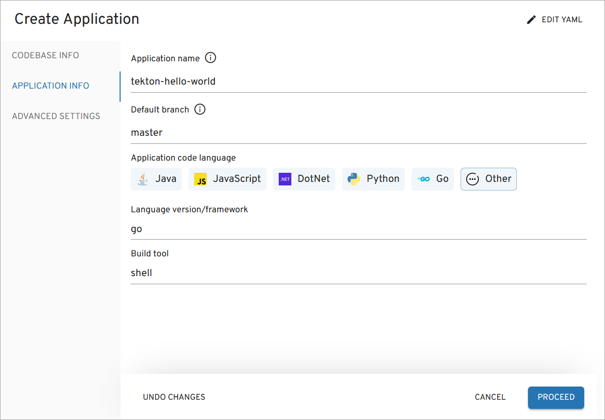

  !!! Note
      These application details are required to match the Pipeline name `gerrit-shell-go-app-build-default`.

      The PipelineRun name is formed with the help of TriggerTemplates in `pipelines-library` so the Pipeline name should correspond to the following structure:
      ```
        pipelineRef:
          name: gerrit-$(tt.params.buildtool)-$(tt.params.framework)-$(tt.params.cbtype)-build-$(tt.params.versioning-type)
      ```
      The PipelineRun is created as soon as Gerrit (or, if configured, GitHub, GitLab) sends a payload during Merge Request events.

7. In the `Advances Settings` tab, define the below values and click the `Apply` button:

  - CI tool: `Tekton`
  - Codebase versioning type: `default`
  - Leave `Specify the pattern to validate a commit message` empty.

  !

8. Check the application status. It should be green:

  !

  Now that the application is created successfully, proceed to adding the Tekton library.

### Add Tekton Library

1. Select the `Components` section under the EDP tab and push the create `+` button:

  !

2. Create a new Codebase with the `Library` type using the `Create` strategy:

  !

  !!! Note
      The EDP Create strategy will automatically pull the code for the Tekton Helm application from [here](https://github.com/epmd-edp/helm-helm-pipeline.git).

3. In the Application Info tab, define the following values and click the `Proceed` button:

  - Application name: `custom-tekton-chart`
  - Default branch: `master`
  - Application code language: `Helm`
  - Language version/framework: `Pipeline`
  - Build tool: `Helm`

  !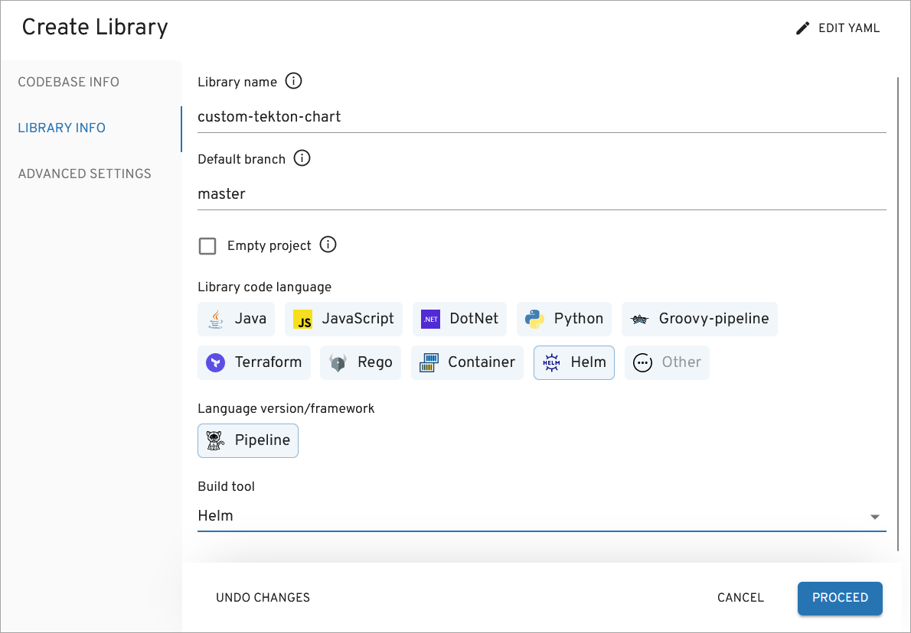

4. In the `Advances Settings` tab, define the below values and click the `Apply` button:

  - CI tool: `Tekton`
  - Codebase versioning type: `default`
  - Leave `Specify the pattern to validate a commit message` empty.

  !

5. Check the codebase status:

  !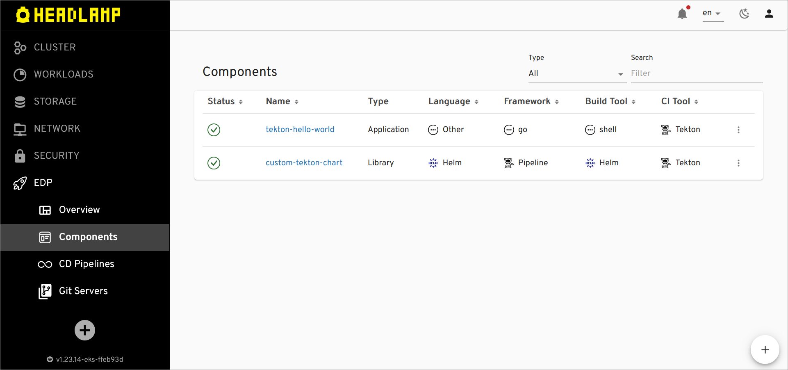

### Modify Tekton Pipeline

!!! Note
    Our recommendation is to avoid modifying the default Tekton resources. Instead, we suggest creating and modifying your own custom Tekton library.

  Now that the Tekton Helm library is created, it is time to clone, modify and then apply it to the Kubernetes cluster.

1. Generate SSH key to work with Gerrit repositories:

  ```
  ssh-keygen -t ed25519 -C "your_email@example.com"
  ```

2. Log into Gerrit UI.

3. Go to Gerrit `Settings` -> `SSH keys`, paste your generated public SSH key to the `New SSH key` field and click `ADD NEW SSH KEY`:

  !
  !

4. Browse Gerrit Repositories and select `custom-tekton-chart` project:

  !

5. Clone the repository with `SSH` using `Clone with commit-msg hook` command:

  !

  !!! Note
      In case of the strict firewall configurations, please use the `HTTP` protocol to pull and configure the `HTTP Credentials` in Gerrit.

6. Examine the repository structure. It should look this way by default:

    ```
    custom-tekton-chart
      ├── Chart.yaml
      ├── chart_schema.yaml
      ├── ct.yaml
      ├── lintconf.yaml
      ├── templates
      │   ├── pipelines
      │   │   └── hello-world
      │   │       ├── gerrit-build-default.yaml
      │   │       ├── gerrit-build-edp.yaml
      │   │       ├── gerrit-build-lib-default.yaml
      │   │       ├── gerrit-build-lib-edp.yaml
      │   │       ├── gerrit-review-lib.yaml
      │   │       ├── gerrit-review.yaml
      │   │       ├── github-build-default.yaml
      │   │       ├── github-build-edp.yaml
      │   │       ├── github-build-lib-default.yaml
      │   │       ├── github-build-lib-edp.yaml
      │   │       ├── github-review-lib.yaml
      │   │       ├── github-review.yaml
      │   │       ├── gitlab-build-default.yaml
      │   │       ├── gitlab-build-edp.yaml
      │   │       ├── gitlab-build-lib-default.yaml
      │   │       ├── gitlab-build-lib-edp.yaml
      │   │       ├── gitlab-review-lib.yaml
      │   │       └── gitlab-review.yaml
      │   └── tasks
      │       └── task-hello-world.yaml
      └── values.yaml
    ```

  !!! Note
      Change the values in the `values.yaml` file.

      The `gitProvider` parameter is the git hosting provider, Gerrit in this example. The similar approach be made with [GitHub, or GitLab](https://github.com/epam/edp-tekton/blob/master/charts/pipelines-library/values.yaml#L23).

      The [dnsWildCard](https://github.com/epam/edp-install/blob/master/deploy-templates/values.yaml#L14) parameter is the cluster DNS address.

      The [gerritSSHPort](https://github.com/epam/edp-install/blob/master/deploy-templates/values.yaml#L30) parameter is the SSH port of the Gerrit service on Kubernetes. Check the Gerrit port in your edp installation  global section.

  !!! Note
      Our custom Helm chart includes [edp-tekton-common-library](https://github.com/epam/edp-tekton/blob/master/charts/common-library/Chart.yaml) dependencies in the `Chart.yaml` file. This library allows to use our predefined code snippets.

  Here is an example of the filled in `values.yaml` file:

  ```
  nameOverride: ""
  fullnameOverride: ""

  global:
    gitProvider: gerrit
    dnsWildCard: "example.domain.com"
    gerritSSHPort: "30009"
  ```

7. Modify and add tasks or pipelines.

  As an example, let's assume that we need to add the `helm-lint` pipeline task to the review pipeline. To implement this, insert the code below to the [gerrit-review.yaml](https://github.com/epmd-edp/helm-helm-pipeline/blob/master/templates/pipelines/hello-world/gerrit-review.yaml#L60) file underneath the hello task:

  ```
      - name: hello
        taskRef:
          name: hello
        runAfter:
        - init-values
        params:
        - name: BASE_IMAGE
          value: "$(params.shell-image-version)"
        - name: username
          value: "$(params.username)"
        workspaces:
          - name: source
            workspace: shared-workspace

      - name: helm-lint
        taskRef:
          kind: Task
          name: helm-lint
        runAfter:
          - hello
        params:
          - name: EXTRA_COMMANDS
            value: |
              ct lint --validate-maintainers=false --charts deploy-templates/
        workspaces:
          - name: source
            workspace: shared-workspace
  ```

  !!! Note
      The `helm-lint` task references to the default `pipeline-library` Helm chart which is applied to the cluster during EDP installation.

      The `runAfter` parameter shows that this Pipeline task will be run after the `hello` pipeline task.

8. Build Helm dependencies in the custom chart:

  ```
  helm dependency update .
  ```

9. Ensure that the chart is valid and all the indentations are fine:

  ```
  helm lint .
  ```

  To validate if the values are substituted in the templates correctly, render the templated YAML files with the values using the following command. It generates and displays all the manifest files with the substituted values:

  ```
  helm template .
  ```

10. Install the custom chart with the command below. You can also use the `--dry-run` flag to simulate the chart installation and catch possible errors:

  ```
  helm upgrade --install edp-tekton-custom . -n edp --dry-run
  ```

  ```
  helm upgrade --install edp-tekton-custom . -n edp
  ```

11. Check the created pipelines and tasks in the cluster:

  ```
  kubectl get tasks -n edp
  kubectl get pipelines -n edp
  ```

12. Commit and push the modified Tekton Helm chart to Gerrit:

  ```
  git add .
  git commit -m "Add Helm chart testing for go-shell application"
  git push origin HEAD:refs/for/master
  ```

13. Check the Gerrit code review for the custom Helm chart pipelines repository in Tekton:

  !

14. Go to `Changes` -> `Open`, click `CODE-REVIEW` and submit the merge request:

  !
  !

15. Check the build Pipeline status for the custom Pipelines Helm chart repository in Tekton:

  !

### Create Application Merge Request

Since we applied the Tekton library to the Kubernetes cluster in the previous step, let's test the review and build pipelines for our `tekton-hello-world` application.

Perform the below steps to merge new code (Merge Request) that passes the Code Review flow. For the steps below, we use Gerrit UI but the same actions can be performed using the command line and Git tool:

1. Log into Gerrit UI, select `tekton-hello-world` project, and create a change request.

2. Browse Gerrit Repositories and select `tekton-hello-world` project:

  !

3. Clone the  `tekton-hello-world` repository to make the necessary changes or click the `Create Change` button in the `Commands` section of the project to make changes via Gerrit GUI:

  !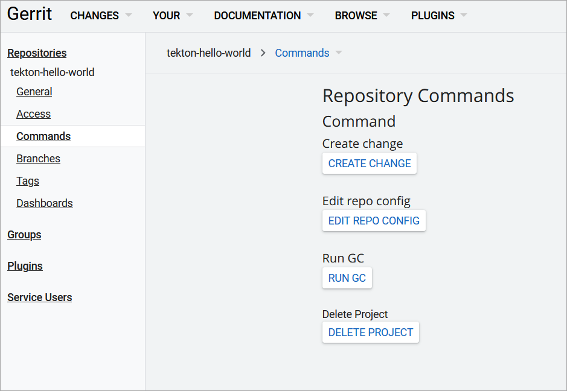

4. In the `Create Change` dialog, provide the branch `master`, write some text in the `Description` (commit message) and click the `Create` button:

  !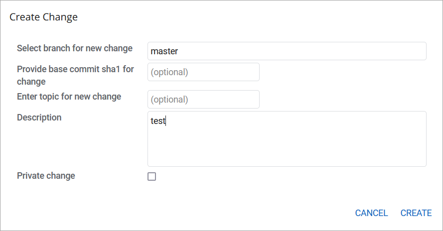

5. Click the `Edit` button of the merge request and add `deployment-templates/values.yaml` to modify it and change the `ingress.enabled flag` from `false` to `true`:

  !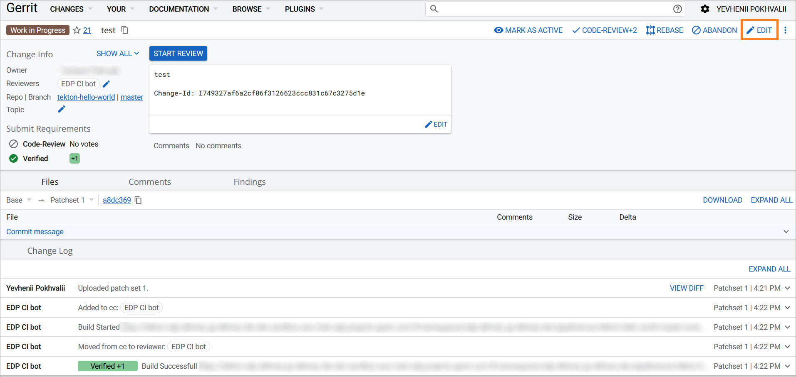
  !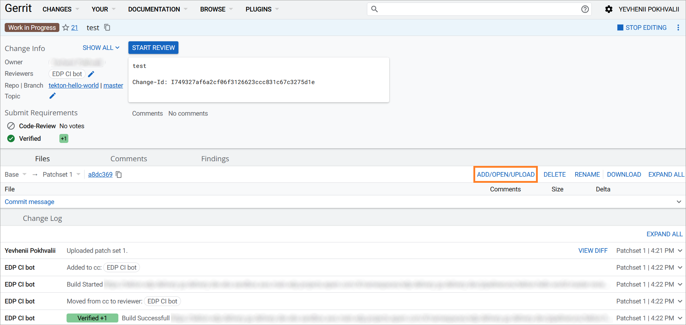

6. Check the Review Pipeline status. The `helm-lint` pipeline task should be displayed there:

  !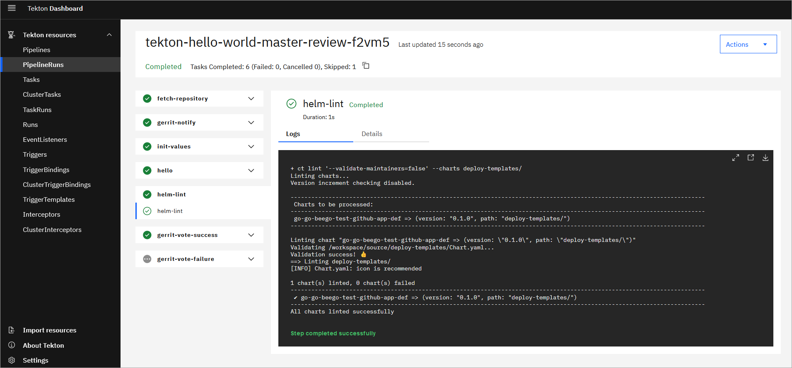

7. Review the `deployment-templates/values.yaml` file and push the `SAVE & PUBLISH` button. As soon as you get `Verified +1` from CI bot, the change is ready for review. Click the `Mark as Active` and `Code-review` buttons:

  !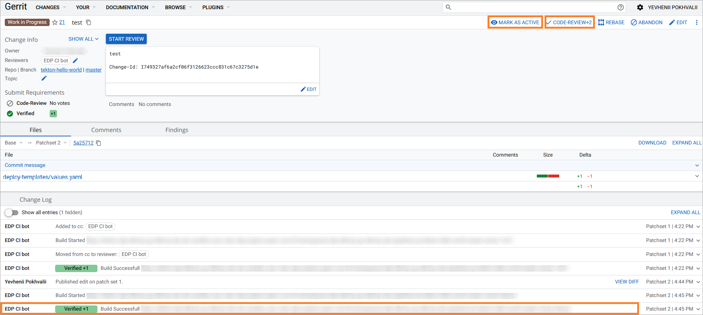

8. Click the `Submit` button. Then, your code is merged to the main branch, triggering the Build Pipeline.

  !

  !!! Note
      If the build is added and configured, push steps in the pipeline, it will produce a new version of artifact, which will be available for the deployment in EDP Portal.

9. Check the pipelines in the Tekton dashboard:

  !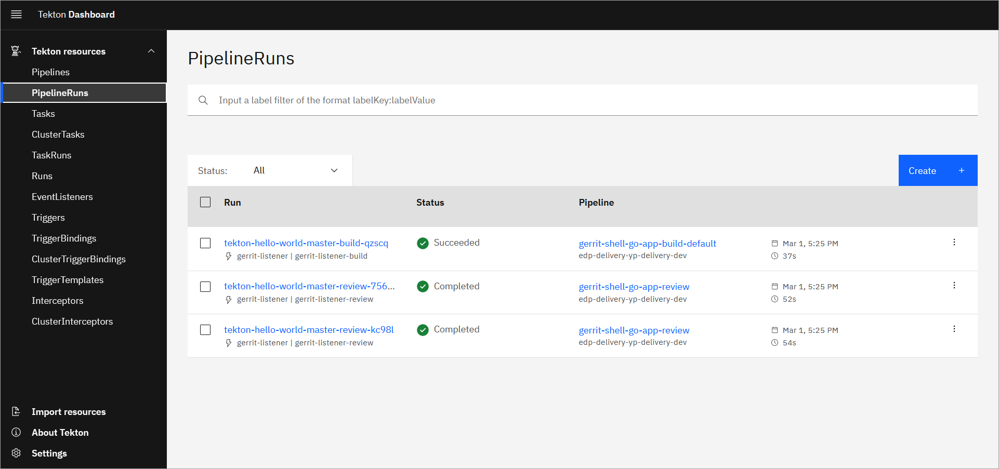
  !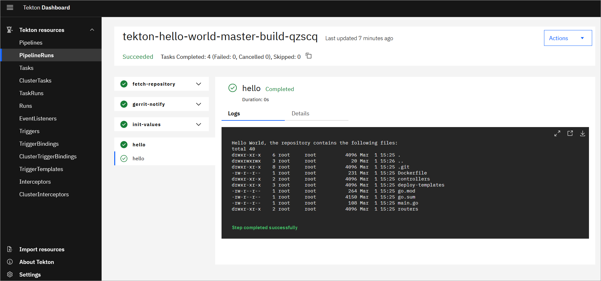

What happens under the hood:<br>
  1) Gerrit sends a payload during Merge Request event to the Tekton EventListener;<br>
  2) EventListener catches it with the help of Interceptor;<br>
  3) TriggerTemplate creates a PipelineRun.

The detailed scheme is shown below:

```mermaid
graph LR;
    A[Gerrit events] --> |Payload| B(Tekton EventListener) --> C(Tekton Interceptor CEL filter) --> D(TriggerTemplate)--> E(PipelineRun)
```

This chart will be using the core of `common-library` and `pipelines-library` and custom resources on the top of them.

## Related Articles

* [Tekton Overview](../operator-guide/tekton-overview.md)
* [Add Application using EDP Portal](../user-guide/add-application.md)
