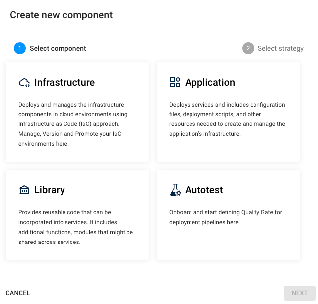
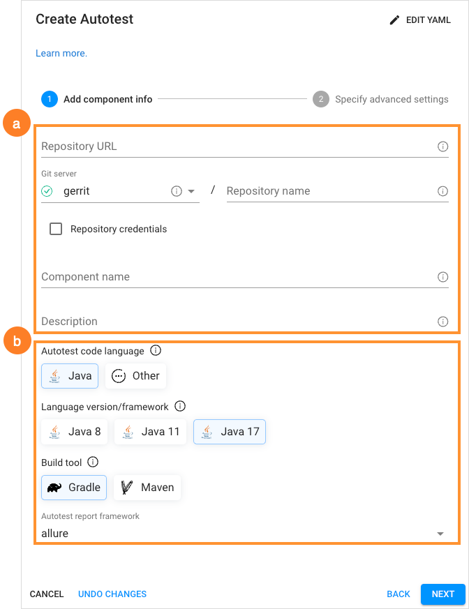
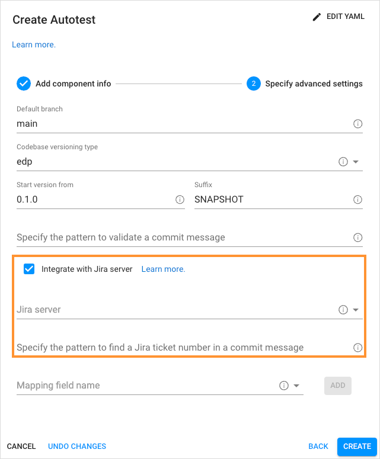
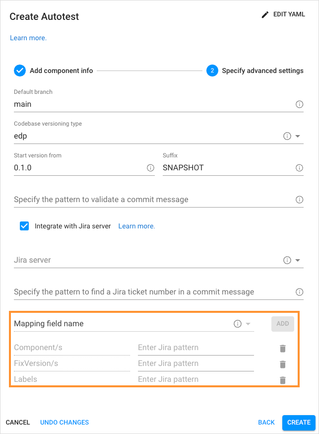

# Add Autotest

EDP Portal allows you to clone an existing repository with the autotest to your Version Control System (VCS), or using an external repository and adding an autotest for further running in stages or using them as quality gates for applications. When an autotest is cloned, the system automatically generates a corresponding repository within the integrated VCS.

!!! info
    Please refer to the [Add Application](add-application.md) section for the details on how to add an application codebase type.
    For the details on how to use autotests as quality gates, please refer to the [Stages Menu](add-cd-pipeline.md#the-stages-menu) section of the [Add Environment](add-cd-pipeline.md) documentation.

To add an autotest, navigate to the **Components** section on the navigation bar and click **Create** (the plus sign icon on the right side of the screen). Once clicked, the **Create new component** dialog will appear, then select **Autotest** and choose one of the strategies which will be described later in this page. You can create an autotest [in YAML](#YAML) or [via the two-step menu](#menu) in the dialog.

## Create Autotest in YAML 

Click **Edit YAML** in the upper-right corner of the **Create Autotest** dialog to open the YAML editor and create an autotest:

!

To edit YAML in the minimal editor, turn on the **Use minimal editor** toggle in the upper-right corner of the **Create Autotest** dialog.

To save the changes, select the **Save & Apply** button.

## Create Autotest via UI 

The **Create Autotest** dialog contains the two steps:

* The Codebase Info Menu
* The Advanced Settings Menu

### The Codebase Info Menu

There are two available strategies: clone and import.

1. The **Create new component** menu should look like the picture below:

  !

2. In the **Create new component** menu, select the necessary configuration strategy. The choice will define the parameters you will need to specify:

  * **Clone project** – clones the indicated repository into EPAM Delivery Platform. While cloning the existing repository, it is required to fill in the **Repository URL** field as well.

  * **Import project** - allows using existing VCS repository to integrate with EDP. While importing the existing repository, select the Git server from the drop-down list and define the relative path to the repository, such as */epmd-edp/examples/basic/edp-auto-tests-simple-example*.

    !!! note
        In order to use the **Import project** strategy, make sure to adjust it with the [Integrate GitLab/GitHub With Tekton](../operator-guide/import-strategy-tekton.md) page.

    In our example, we will use the **Clone project** strategy:

    !

    1. While cloning the existing repository, it is required to fill in the **Repository URL** field.

    2. Select the Git server from the drop-down list and define the relative path to the repository, such as `/epmd-edp/examples/basic/edp-auto-tests-simple-example`.

    3. Select the **Repository credentials** check box in case you clone the private repository, and fill in the repository login and password/access token.

    4. Fill in the **Component name** field by entering at least two characters and by using the lower-case letters, numbers and inner dashes.

    5. Type the necessary description in the **Description** field.

    6. In the **Autotest code language** field, select the Java code language with its framework (specify Java 8 or Java 11 to be used) and get the default Maven build tool OR add another code language. Selecting **Other** allows extending the default code languages and get the necessary build tool, for details, inspect the [Add Other Code Language](../operator-guide/add-other-code-language.md) section.

      !!! note
          Using the **Create** strategy does not allow to customize the default code language set.

    7. Select the Java framework if Java is selected above.

    8. The **Build Tool** field can dispose of the default Maven tool, Gradle or other built tool in accordance with the selected code language.

    9. All the autotest reports will be created in the Allure framework that is available in the **Autotest Report Framework** field by default.

3. Click the **Proceed** button to switch to the next menu.

  ### The Advanced Settings Menu

The **Advanced Settings** menu should look like the picture below:

  !

a. Specify the name of the default branch where you want the development to be performed.

!!! note
    The default branch cannot be deleted.

b. Select the necessary codebase versioning type:

* **default**: Using the default versioning type, in order to specify the version of the current artifacts, images, and tags in the Version Control System, a developer should navigate to the corresponding file and change the version **manually**.

* **edp**: Using the edp versioning type, a developer indicates the version number from which all the artifacts will be versioned and, as a result, **automatically** registered in the corresponding file (e.g. pom.xml).

  When selecting the edp versioning type, the extra field will appear:

  !

  Type the version number from which you want the artifacts to be versioned.

!!! note
    The **Start Version From** field must be filled out in compliance with the semantic versioning rules, e.g. 1.2.3 or 10.10.10. Please refer to the [Semantic Versioning](https://semver.org/) page for details.

c. Specify the pattern to validate a commit message. Use regular expression to indicate the pattern that is followed on the project to validate a commit message in the code review pipeline. An example of the pattern: `^[PROJECT_NAME-d{4}]:.*$`

  !

d. Select the **Integrate with Jira Server** check box in case it is required to connect Jira tickets with the commits and have a respective label in the Fix Version field.

!!! note
    To adjust the Jira integration functionality, first apply the necessary changes described on the [Adjust Jira Integration](../operator-guide/jira-integration.md) page, and [Adjust VCS Integration With Jira](../operator-guide/jira-gerrit-integration.md). Pay attention that the Jira integration feature is not available when using the GitLab CI tool.

e. As soon as the Jira server is set, select it in the **Jira Server** field.

f. Specify the pattern to find a Jira ticket number in a commit message. Based on this pattern, the value from EDP will be displayed in Jira.

  !

g. In the **Advanced Mapping** section, specify the names of the Jira fields that should be filled in with attributes from EDP:

1. Select the name of the field in a Jira ticket. The available fields are the following: *Fix Version/s*, *Component/s* and *Labels*.

2. Click the **Add** button to add the mapping field name.

3. Enter Jira pattern for the field name:

  * For the **Fix Version/s** field, select the **EDP_VERSION** variable that represents an EDP upgrade version, as in _2.7.0-SNAPSHOT_.
  Combine variables to make the value more informative. For example, the pattern **EDP_VERSION-EDP_COMPONENT** will be displayed as _2.7.0-SNAPSHOT-nexus-operator_ in Jira.
  * For the **Component/s** field select the **EDP_COMPONENT** variable that defines the name of the existing repository. For example, _nexus-operator_.
  * For the **Labels** field select the **EDP_GITTAG**variable that defines a tag assigned to the commit in Git Hub. For example, _build/2.7.0-SNAPSHOT.59_.

4. Click the bin icon to remove the Jira field name.

h. Click the **Apply** button to add the library to the Libraries list.

!!! note
    After the complete adding of the autotest, inspect the [Autotest Overview](autotest.md) part.

## Related Articles

* [Manage Autotests](autotest.md)
* [Add Application](add-application.md)
* [Add CD Pipelines](add-cd-pipeline.md)
* [Add Other Code Language](../operator-guide/add-other-code-language.md)
* [Adjust Jira Integration](../operator-guide/jira-integration.md)
* [Adjust VCS Integration With Jira](../operator-guide/jira-gerrit-integration.md)
* [Integrate GitHub/GitLab in Tekton](../operator-guide/import-strategy-tekton.md)
* [Perf Server Integration](../operator-guide/perf-integration.md)
