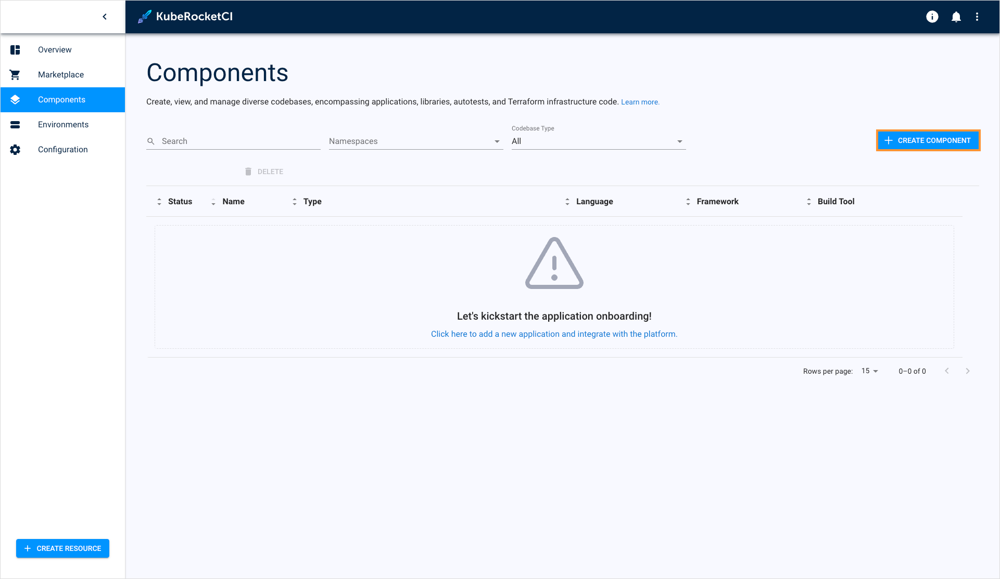
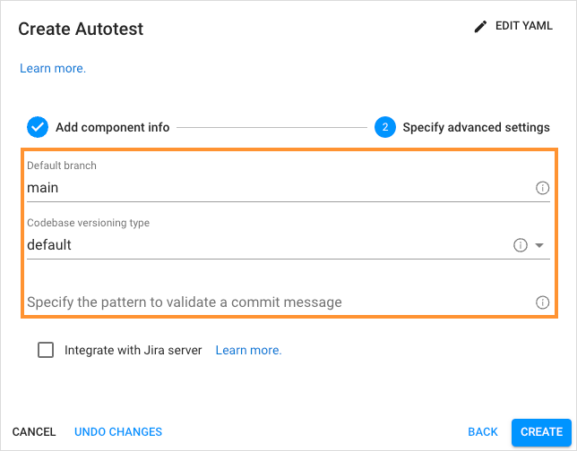

# Add Autotest

EDP Portal allows you to clone an existing repository with the autotest to your Version Control System (VCS), or using an external repository and adding an autotest for further running in stages or using them as quality gates for applications. When an autotest is cloned, the system automatically generates a corresponding repository within the integrated VCS. You can create an autotest [in YAML](#YAML) or [via the two-step menu](#menu) in the dialog.

!!! info
    Please refer to the [Add Application](add-application.md) section for the details on how to add an application codebase type.
    For the details on how to use autotests as quality gates, please refer to the [Stages Menu](add-cd-pipeline.md#the-stages-menu) section of the [Add Environment](add-cd-pipeline.md) documentation.

To add an autotest, navigate to the **Components** section on the navigation bar and click **+ Create**:

  !

Once clicked, the **Create new component** dialog will appear, then select **Autotest** and choose one of the strategies:

  !

* **Clone project** – clones the indicated repository into EPAM Delivery Platform. While cloning the existing repository, it is required to fill in the **Repository URL** field and specify the credentials if needed.

* **Import project** - allows using existing VCS repository to integrate with EDP. While importing the existing repository, select the Git server from the drop-down list and define the relative path to the repository, such as `/epmd-edp/examples/basic/edp-auto-tests-simple-example`.

  !!! note
      In order to use the **Import project** strategy, make sure to adjust it with the [Integrate GitLab/GitHub With Tekton](../operator-guide/import-strategy-tekton.md) page.

## Create Autotest in YAML 

Click **Edit YAML** in the upper-right corner of the **Create Autotest** dialog to open the YAML editor and create an autotest:

!

To edit YAML in the minimal editor, turn on the **Use minimal editor** toggle in the upper-right corner of the **Create Autotest** dialog.

To save the changes, select the **Save & Apply** button.

## Create Autotest via UI 

The **Create Autotest** dialog contains the two steps:

* The Codebase Info Menu
* The Advanced Settings Menu

### The Codebase Info Menu

In our case, we will use the **Clone** strategy:

  !

1. Select all the settings that define how the autotest will be added to Git server:

  * **Git server** - the pre-configured server where the component will be hosted. Select one from the from the drop-down list. Please refer to the [Manage Git Servers](git-server-overview.md) page to learn how to create the one.
  * **Repository name** - the relative path to the repository, such as `/epmd-edp/examples/basic/edp-auto-tests-simple-example`.
  * **Component name** - the name of the autotest. Must be at least two characters using the lower-case letters, numbers and inner dashes.
  * **Description** - brief and concise description that explains the purpose of the autotest.

2. Specify the autotest language properties:

  * **Autotest code language** - defines the code language with its supported frameworks. Selecting **Other** allows extending the default code languages and get the necessary build tool.
  * **Language version/framework** - defines the specific framework or language version of the autotest. The field depends on the selected code language. Specify Java 8, Java 11 or Java 17 to be used.
  * **Build Tool** - allows to choose the build tool to use. In case of autotests, Gradle and Maven are available.
  * **Autotest report framework** - all the autotest reports will be created in the Allure framework by default.

Click the **Proceed** button to switch to the next menu.

### The Advanced Settings Menu

In the **Advanced Settings** menu, specify the branch options and define the Jira settings:

  !

* **Default branch** - the name of the branch where you want the development to be performed.

  !!! note
      The default branch cannot be deleted.

* **Codebase versioning type** - defines how will the autotest tag be changed once the new image version is built. There are two versioning types:
  * **default**: Using the default versioning type, in order to specify the version of the current artifacts, images, and tags in the Version Control System, a developer should navigate to the corresponding file and change the version **manually**.
  * **edp**: Using the edp versioning type, a developer indicates the version number from which all the artifacts will be versioned and, as a result, **automatically** registered in the corresponding file (e.g. pom.xml). When selecting the edp versioning type, the extra fields will appear, type the version number from which you want the artifacts to be versioned:

  !

  Type the version number from which you want the artifacts to be versioned.

!!! note
    The **Start Version From** field must be filled out in compliance with the semantic versioning rules, e.g. 1.2.3 or 10.10.10. Please refer to the [Semantic Versioning](https://semver.org/) page for details.

* **Specify the pattern to validate a commit message** - the regular expression used to indicate the pattern that is followed on the project to validate a commit message in the code review pipeline. An example of the pattern: `^[PROJECT_NAME-d{4}]:.*$`.

  !

* **Integrate with Jira server** - this check box is used in case it is required to connect Jira tickets with the commits
and have a respective label in the **Fix Version** field.

!!! note
    To adjust the Jira integration functionality, first apply the necessary changes described on the [Adjust Jira Integration](../operator-guide/jira-integration.md) page, and [Adjust VCS Integration With Jira](../operator-guide/jira-gerrit-integration.md).

* **Jira Server** - the integrated Jira server with related Jira tasks.

* **Specify the pattern to find a Jira ticket number in a commit message** - based on this pattern, the value from EDP will be displayed in Jira.

  !

* **Mapping field name** - the section where the additional Jira fields are specified the names of the Jira fields that should be filled in with attributes from EDP:

  * Select the name of the field in a Jira ticket. The available fields are the following: *Fix Version/s*, *Component/s* and *Labels*.

  * Click the **Add** button to add the mapping field name.

  * Enter Jira pattern for the field name:

    * For the **Fix Version/s** field, select the **EDP_VERSION** variable that represents an EDP upgrade version, as in _2.7.0-SNAPSHOT_.Combine variables to make the value more informative. For example, the pattern **EDP_VERSION-EDP_COMPONENT** will be displayed as _2.7.0-SNAPSHOT-nexus-operator_ in Jira.
    * For the **Component/s** field select the **EDP_COMPONENT** variable that defines the name of the existing repository. For example, _nexus-operator_.
    * For the **Labels** field select the **EDP_GITTAG**variable that defines a tag assigned to the commit in Git Hub. For example, _build/2.7.0-SNAPSHOT.59_.

  * Click the bin icon to remove the Jira field name.

After the complete adding of the autotest, inspect the [Autotest Overview](autotest.md) page to learn how you can operate applications.

## Related Articles

* [Manage Autotests](autotest.md)
* [Add Application](add-application.md)
* [Add CD Pipelines](add-cd-pipeline.md)
* [Adjust Jira Integration](../operator-guide/jira-integration.md)
* [Adjust VCS Integration With Jira](../operator-guide/jira-gerrit-integration.md)
* [Integrate GitHub/GitLab in Tekton](../operator-guide/import-strategy-tekton.md)
