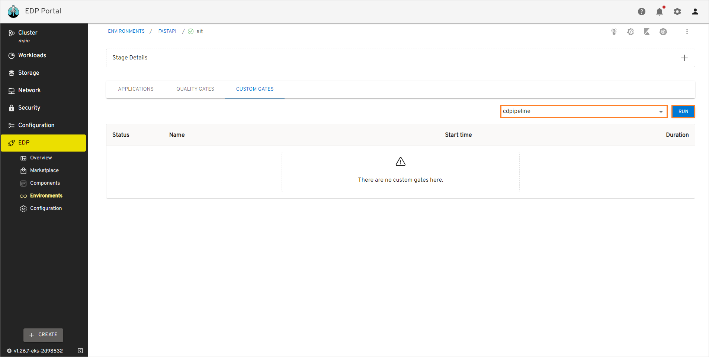
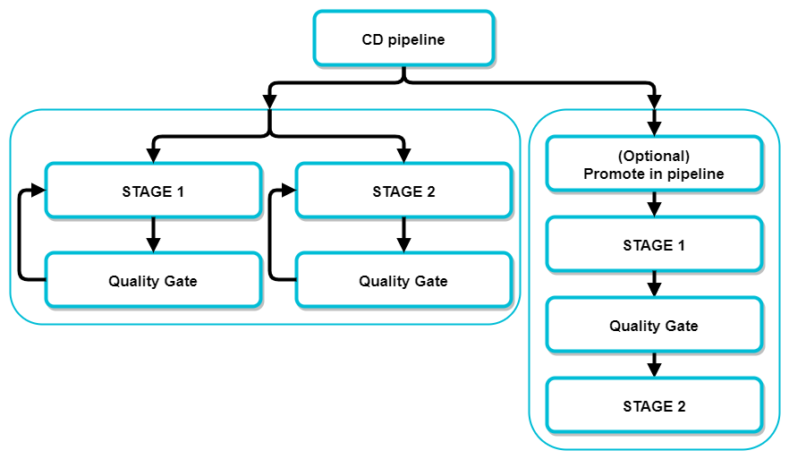

# Add Quality Gate

This section describes how to use quality gate in EDP and how to customize the quality gate for the CD pipeline with the selected build version of the promoted application between stages.

## Apply New Quality Gate to Pipelines
Quality gate pipeline is a usual Tekton pipeline but with a specific label: `app.edp.epam.com/pipelinetype: deploy`. To add and apply the quality gate to your pipelines, follow the steps below:

  1. To use the Tekton pipeline as a quality gate pipeline, add this label to the pipelines:
    ```
    metadata:
      labels:
        app.edp.epam.com/pipelinetype: deploy
    ```
  2. Insert the <name-of-quality-gate> value that is the quality gate name displayed in the quality gate drop-down list of the CD pipeline menu:
    ```
    metadata:
      name: <name-of-quality-gate>
    ```
  3. Ensure the task `promote-images` contains steps and logic to apply to the project. Also ensure that the last task is `promote-images` which parameters are mandatory:
    ```
    spec:
      params:
        - default: ''
          description: Codebases with a tag separated with a space.
          name: CODEBASE_TAG
          type: string
        - default: ''
          name: CDPIPELINE_CR
          type: string
        - default: ''
          name: CDPIPELINE_STAGE
          type: string
      tasks:
        - name: promote-images
          params:
            - name: CODEBASE_TAG
              value: $(params.CODEBASE_TAG)
            - name: CDPIPELINE_STAGE
              value: $(params.CDPIPELINE_STAGE)
            - name: CDPIPELINE_CR
              value: $(params.CDPIPELINE_CR)
          runAfter:
            - <last-task-name>
          taskRef:
            kind: Task
            name: promote-images
    ```
  4. Create a new pipeline with a unique name or modify your created pipeline with the command below. Please be aware that the ‹edp-project› value is the name of the EDP tenant:
      ```
      kubectl apply -f <file>.yaml --namespace edp
      ```
   <details>
   <summary><b>Example: file.yaml</b></summary>
       ```
        apiVersion: tekton.dev/v1beta1
        kind: Pipeline
        metadata:
          labels:
            app.edp.epam.com/pipelinetype: deploy
          name: <name-of-quality-gate>
          namespace: edp
        spec:
          params:
            - default: >-
                https://<CI-pipeline-provisioner>-edp.<cluster-name>.aws.main.edp.projects.epam.com/#/namespaces/$(context.pipelineRun.namespace)/pipelineruns/$(context.pipelineRun.name)
              name: pipelineUrl
              type: string
            - default: ''
              description: Codebases with a tag separated with a space.
              name: CODEBASE_TAG
              type: string
            - default: ''
              name: CDPIPELINE_CR
              type: string
            - default: ''
              name: CDPIPELINE_STAGE
              type: string
          tasks:
            - name: autotests
              params:
                - name: BASE_IMAGE
                  value: bitnami/kubectl:1.25.4
                - name: EXTRA_COMMANDS
                  value: echo "Hello World"
              taskRef:
                kind: Task
                name: run-quality-gate
            - name: promote-images
              params:
                - name: CODEBASE_TAG
                  value: $(params.CODEBASE_TAG)
                - name: CDPIPELINE_STAGE
                  value: $(params.CDPIPELINE_STAGE)
                - name: CDPIPELINE_CR
                  value: $(params.CDPIPELINE_CR)
              runAfter:
                - autotests
              taskRef:
                kind: Task
                name: promote-images
       ```
   </details>

## Run Quality Gate

Before running the quality gate, first of all, ensure that the environment has deployed the [created CD pipeline](add-cd-pipeline.md#create-cd-pipeline-in-the-dialog) and then ensure that the application is successfully deployed and ready to run the quality gate. To run quality gate, please follow the steps below:

1. Check the CD pipeline status. To do this, open the created CD pipeline, select `Image stream version`, click `DEPLOY` button and wait until `Applications`, `Health` and `Sync` statuses become `green`. This implies that the application is successfully deployed and ready to run the quality gate.

    !

2. Select the name-of-quality-gate of `Quality gates` from the drop-down list and click the `RUN` button.<br>The execution process should be started in the `Pipelines` menu:

    !

## Add Stage for Quality Gate

For a better understanding of this section, please read the documentation about how to [add a new stage for quality gate](add-cd-pipeline.md#add-a-new-stage).<br>
The scheme below illustrates two approaches of adding quality gates:

!

- The first type of adding a quality gate is about adding the specific quality gate to the specific pipeline stage.

- The second type is rather optional and implies activating the `Promote in pipelines` option while creating a CD Pipeline to pass the quality gate in a certain sequence.

As a result, after the quality gate is successfully passed, the projected image is promoted to the next stage.

## Related Articles

* [Manage Environments](../user-guide/manage-environments.md)
* [Add CD Pipeline](../user-guide/add-cd-pipeline.md)
