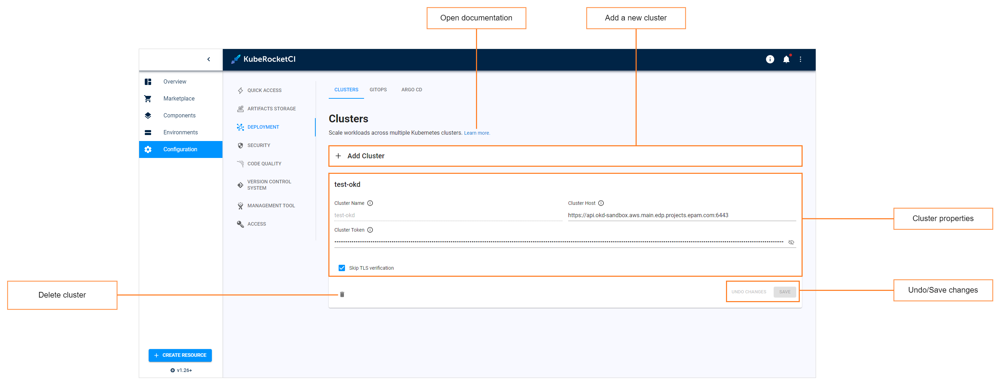

# Manage Clusters

This section describes the subsequent possible actions that can be performed with the newly added or existing clusters.

In a nutshell, cluster in EDP Portal is a Kubernetes secret that stores credentials and enpoint to connect to the another cluster. Adding new clusters allows users to deploy applications in several clusters, thus improving flexibilty of your infrastructure.

The added cluster will be listed in the clusters list allowing you to do the following:

!

## View Authentication Data

To view authentication data that is used to log in to the cluster, run the `kubectl describe` command:

  ```bash
  kubectl describe secret cluster_name -n <edp-project>
  ```

## Delete Cluster

To delete cluster, use the `kubectl delete` command as follows:

  ```bash
  kubectl delete secret cluster_name -n <edp-project>
  ```

## Related Articles

* [Add Cluster](../user-guide/add-cluster.md)
* [Add Application](../user-guide/add-application.md)
