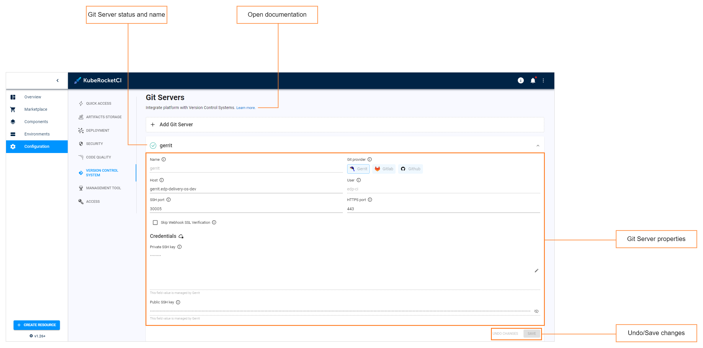

# Manage Git Servers

Git Server is a custom resource that is required for using the import strategy when creating a new component, whether it is an application, library, autotest or infrastructure.

Under the hood, Git server in EDP Portal is a Kubernetes secret that stores credentials to the remote Git server.

The added application will be listed in the Applications list allowing you to do the following:

!

* **Git Server status** - displays the Git Server status. Can be red or green depending on if the EDP Portal managed to connect to the Git Server with the specified credentials or not.

* **Git Server name** - displays the Git Server name set during the Git Server creation.

* **Open documentation** - opens the documentation that leads to this page.

* **Enable filtering** - enables filtering by Git Server name and namespace where this custom resource is located in.

* **Create new Git Server** - displays the **Create Git Server** menu.

!!! note
    Git Server can't be deleted via the EDP Portal UI. Use the `kubectl delete GitServer <Git_server_name> -n edp` command to delete the GitServer custom resource.

## View Authentication Data

To view authentication data that is used to connect to the Git server, use `kubectl describe` command as follows:

  ```bash
  kubectl describe GitServer git_server_name -n edp
  ```

## Delete Git Server

To remove a Git Server from the Git Servers list, utilize the `kubectl delete` command as follows:

  ```bash
  kubectl delete GitServer git_server_name -n edp
  ```

# Related Articles

* [Add Git Server](../user-guide/add-git-server.md)
