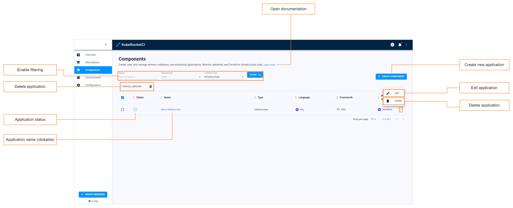
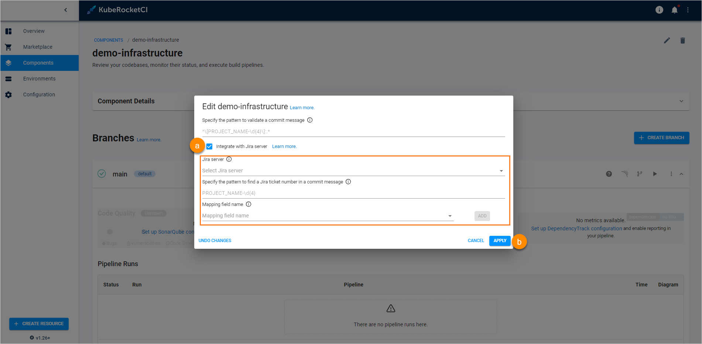

# Manage Infrastructures

This section describes the subsequent possible actions that can be performed with the newly added or existing infrastructures.

## Check and Remove Application

As soon as the infrastructure is successfully provisioned, the following will be created:

- Code Review and Build pipelines in Jenkins/Tekton for this application. The Build pipeline will be triggered automatically if at least one environment is already added.
- A new project in Gerrit or another VCS.
- SonarQube integration will be available after the Build pipeline in Jenkins/Tekton is passed.
- Nexus Repository Manager will be available after the Build pipeline in Jenkins/Tekton is passed as well.

The added application will be listed in the Applications list allowing you to do the following:

!

* **Infrastructure status** - displays the Git Server status. Can be red or green depending on if the EDP Portal managed to connect to the Git Server with the specified credentials or not.
* **Infrastructure name (clickable)** - displays the infrastructure name set during the Git Server creation.
* **Open documentation** - opens the documentation that leads to this page.
* **Enable filtering** - enables filtering by Git Server name and namespace where this custom resource is located in.
* **Create new infrastructure** - displays the **Create new component** menu.
* **Edit infrastructure** - edit the infrastructure by selecting the options icon next to its name in the infrastructures list, and then selecting **Edit**. For details see the [Edit Existing Application](#edit-existing-application) section.
* **Delete infrastructure** - remove infrastructure by selecting the options icon next to its name in the infrastructures list, and then selecting **Delete**.

There are also options to sort the infrastructures:

* Sort the existing infrastructures in a table by clicking the sorting icons in the table header. Sort the infrastructures alphabetically by their name, language, build tool, framework, and CI tool. You can also sort the infrastructures by their status: Created, Failed, or In progress.

* Select a number of infrastructures displayed per page (15, 25 or 50 rows)  and navigate between pages if the number of applications exceeds the capacity of a single page.

## Edit Existing Infrastructure

EDP Portal provides the ability to enable, disable or edit the Jira Integration functionality for infrastructures.

1. To edit an infrastructure directly from the infrastructures overview page or when viewing the infrastructure data:

  - Select **Edit** in the options icon menu:

  !

  !

  - The **Edit Infrastructure** dialog opens.

2. To enable Jira integration, in the **Edit Infrastructure** dialog do the following:

   !

   a. Mark the **Integrate with Jira server** check box and fill in the necessary fields. Please see steps d-h on the [Add Infrastructure page](add-infrastructure.md#the-advanced-settings-menu).

   b. Select the **Apply** button to apply the changes.

   c. Navigate to Jenkins/Tekton and add the _create-jira-issue-metadata_ stage in the Build pipeline. Also add the _commit-validate_ stage in the Code Review pipeline.

3. To disable Jira integration, in the **Edit Infrastructure** dialog do the following:

   a. Uncheck the **Integrate with Jira server** check box.

   b. Select the **Apply** button to apply the changes.

   c. Navigate to Jenkins/Tekton and remove the _create-jira-issue-metadata_ stage in the Build pipeline. Also remove the _commit-validate_ stage in the Code Review pipeline.

4. To create, edit and delete infrastructure branches, please refer to the [Manage Branches](../user-guide/manage-branches.md) page.

## Related Articles

* [Add Infrastructure](add-infrastructure.md)
* [Manage Branches](../user-guide/manage-branches.md)
